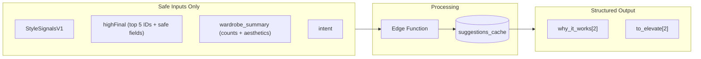

# Epic 1: AI Personalized Suggestions

## Goal

Create a "stylist feel" with personalized bullets that explain why matches work and what could elevate the look. Keep it small, safe, and cached.

**Output format:**

- `why_it_works`: 2 bullets (references owned items by ID)
- `to_elevate`: 2 bullets (always "consider adding..." format)
- No `shopping_note` yet (v2)
- No CTAs, no complex UI

---

## Architecture



**Key principle:** Pure renderer - consumes FinalizedMatches, does NOT influence tiers.

---

## 1. Database: Cache Table

Create `supabase/migrations/015_personalized_suggestions_cache.sql`:

```sql
CREATE TABLE personalized_suggestions_cache (
  id UUID PRIMARY KEY DEFAULT gen_random_uuid(),
  user_id UUID NOT NULL REFERENCES auth.users(id) ON DELETE CASCADE,
  cache_key TEXT NOT NULL,  -- SHA-256 hash (64 chars)
  
  -- Structured response
  suggestions JSONB NOT NULL,
  
  -- Versioning for invalidation
  prompt_version INT NOT NULL DEFAULT 1,
  schema_version INT NOT NULL DEFAULT 1,
  
  -- Telemetry
  latency_ms INT,
  source TEXT NOT NULL DEFAULT 'ai_call',
  
  -- Timestamps and hit tracking
  created_at TIMESTAMPTZ NOT NULL DEFAULT now(),
  expires_at TIMESTAMPTZ NOT NULL DEFAULT (now() + interval '7 days'),
  hit_count INT NOT NULL DEFAULT 0,
  last_hit_at TIMESTAMPTZ,
  
  -- Optional: for debugging/analytics
  scan_id TEXT
);

-- IMPORTANT: Uniqueness is per-user, not global
-- (two users could theoretically have same scanId + topIds)
CREATE UNIQUE INDEX uq_suggestions_user_cache_key
  ON personalized_suggestions_cache(user_id, cache_key);

CREATE INDEX idx_suggestions_cache_user ON personalized_suggestions_cache(user_id);
CREATE INDEX idx_suggestions_expires ON personalized_suggestions_cache(expires_at);

-- RLS
ALTER TABLE personalized_suggestions_cache ENABLE ROW LEVEL SECURITY;

-- Users can read their own suggestions
CREATE POLICY "Users can read own suggestions"
  ON personalized_suggestions_cache FOR SELECT
  USING (auth.uid() = user_id);

-- Users can update their own (for hit_count, last_hit_at)
CREATE POLICY "Users can update own suggestions"
  ON personalized_suggestions_cache FOR UPDATE
  USING (auth.uid() = user_id)
  WITH CHECK (auth.uid() = user_id);

-- NOTE: INSERT is done via Edge Function using service role (bypasses RLS)
-- If you want RLS-only, add:
-- CREATE POLICY "Users can insert own suggestions"
--   ON personalized_suggestions_cache FOR INSERT
--   WITH CHECK (auth.uid() = user_id);

-- Cleanup function with hardened SECURITY DEFINER
CREATE OR REPLACE FUNCTION cleanup_suggestions_cache(retention_days INT DEFAULT 30)
RETURNS INT
LANGUAGE plpgsql
SECURITY DEFINER
SET search_path = public
AS $$
DECLARE deleted_count INT;
BEGIN
  DELETE FROM personalized_suggestions_cache
  WHERE expires_at < now()
     OR created_at < now() - (retention_days || ' days')::interval;

  GET DIAGNOSTICS deleted_count = ROW_COUNT;
  RETURN deleted_count;
END;
$$;

-- Function to increment cache hit (called by client via RPC)
-- SECURITY: Only allows incrementing for the calling user's own cache entries
CREATE OR REPLACE FUNCTION increment_suggestions_cache_hit(
  p_cache_key TEXT
)
RETURNS VOID
LANGUAGE plpgsql
SECURITY DEFINER
SET search_path = public
AS $$
BEGIN
  -- Only update rows belonging to the calling user (auth.uid())
  -- This prevents users from bumping other users' cache hit counts
  UPDATE personalized_suggestions_cache
  SET hit_count = hit_count + 1,
      last_hit_at = now()
  WHERE user_id = auth.uid()
    AND cache_key = p_cache_key
    AND expires_at > now();  -- Don't count hits on expired entries
END;
$$;

-- IMPORTANT: Revoke default PUBLIC execute, then grant only to authenticated
-- (Postgres functions can be PUBLIC-executable by default)
REVOKE EXECUTE ON FUNCTION increment_suggestions_cache_hit(TEXT) FROM PUBLIC;
GRANT EXECUTE ON FUNCTION increment_suggestions_cache_hit(TEXT) TO authenticated;

-- Cleanup function: only callable by service role (scheduled job) or admin
-- Don't grant to authenticated - this is a maintenance function
REVOKE EXECUTE ON FUNCTION cleanup_suggestions_cache(INT) FROM PUBLIC;
-- GRANT EXECUTE ON FUNCTION cleanup_suggestions_cache(INT) TO service_role; -- if needed
```

**Implementation Pattern: Service Role for Writes, RLS for Reads**

```
┌─────────────────────────────────────────────────────────────────┐
│  CLIENT                           │  EDGE FUNCTION              │
├───────────────────────────────────┼─────────────────────────────┤
│  1. Check cache (RLS SELECT)      │                             │
│  2. If hit: call RPC to increment │                             │
│  3. If miss: call Edge Function ──┼──► 4. Call OpenAI           │
│                                   │     5. Write cache (service │
│                                   │        role, bypasses RLS)  │
│  6. Receive response              │◄──                          │
└───────────────────────────────────┴─────────────────────────────┘
```

**Cache key format (hashed for compactness):**

```typescript
// Raw key string (for logging/debugging)
const rawKey = `${scanId}|${topK_ids_sorted_joined}|${wardrobeUpdatedAt}|${promptVersion}|${schemaVersion}`;

// IMPORTANT: wardrobeUpdatedAt must be stable ISO string (same format every time)
// Use: new Date(timestamp).toISOString() - NOT Date object or locale string

// Stored key is SHA-256 hash (64 chars, stable, efficient indexing)
const cacheKey = sha256(rawKey);
```

**Cache Expiration Behavior (v1: Hard TTL)**

```typescript
// When reading from cache, check expiration:
async function checkSuggestionsCache(cacheKey: string): Promise<PersonalizedSuggestions | null> {
  const { data } = await supabase
    .from('personalized_suggestions_cache')
    .select('suggestions, expires_at')
    .eq('cache_key', cacheKey)
    .eq('user_id', userId)
    .gt('expires_at', new Date().toISOString())  // Hard TTL: don't serve expired
    .single();
  
  return data?.suggestions ?? null;
}
```

---

## 2. Type Definitions

Add to [src/lib/types.ts](src/lib/types.ts):

```typescript
/** Structured suggestion output - prevents hallucination */
export interface PersonalizedSuggestions {
  version: 1;
  why_it_works: SuggestionBullet[];  // exactly 2
  to_elevate: ElevateBullet[];       // exactly 2
}

export interface SuggestionBullet {
  text: string;  // Model writes explanation WITHOUT mentioning item names/IDs
  mentions: string[];  // item IDs from highFinal (validated against input)
}

export interface ElevateBullet {
  text: string;
  recommend: {
    type: 'consider_adding';  // enforced - never reference owned items
    category: Category;
    attributes: string[];  // e.g., ['tan', 'structured']
  };
}

/** Input for suggestions Edge Function */
export interface SuggestionsInput {
  scan_signals: StyleSignalsV1;
  top_matches: SafeMatchInfo[];  // max 5
  wardrobe_summary: WardrobeSummary;
  intent: 'shopping' | 'own_item';
}

/**
 * Safe subset of wardrobe item data sent to model.
 * IMPORTANT: aesthetic comes from the WARDROBE ITEM's signals,
 * NOT the scan's signals (which would be confusing to the model).
 */
export interface SafeMatchInfo {
  id: string;
  category: Category;
  dominant_color: string;
  aesthetic: AestheticArchetype;  // From wardrobeItem.style_signals_v1.aesthetic.primary
  label?: string;  // Optional: detected label like "navy blazer"
}

export interface WardrobeSummary {
  total: number;
  by_category: Record<Category, number>;
  dominant_aesthetics: AestheticArchetype[];
  updated_at: string;
}

/** Allowed category values for to_elevate recommendations */
export const ALLOWED_ELEVATE_CATEGORIES: Category[] = [
  'tops', 'bottoms', 'shoes', 'outerwear', 'dresses', 'accessories', 'bags', 'skirts'
];
```

---

## 3. Edge Function

Create `supabase/functions/personalized-suggestions/index.ts`:

**Prompt structure (hardened to reduce hallucinations):**

```
You are a personal stylist providing brief, specific advice.

CONTEXT:
- Scanned item: {scan_signals_summary}
- Matched wardrobe items (ONLY these IDs exist): {top_matches_with_ids}
- Wardrobe overview: {wardrobe_summary}

OUTPUT FORMAT (strict JSON):
{
  "why_it_works": [
    { "text": "explanation without naming items", "mentions": ["ITEM_ID"] },
    { "text": "explanation without naming items", "mentions": ["ITEM_ID"] }
  ],
  "to_elevate": [
    { "text": "why this would help", "recommend": { "type": "consider_adding", "category": "CATEGORY", "attributes": ["attr1", "attr2"] } },
    { "text": "why this would help", "recommend": { "type": "consider_adding", "category": "CATEGORY", "attributes": ["attr1", "attr2"] } }
  ]
}

STRICT RULES:
1. "mentions" array MUST ONLY contain IDs from: [{valid_ids_list}]
2. NEVER write item names, labels, or descriptions in "text" - only put IDs in "mentions"
3. NEVER claim the user owns something not in the provided list
4. "to_elevate" MUST use type: "consider_adding" (never reference owned items)
5. "category" in to_elevate MUST be one of: tops, bottoms, shoes, outerwear, dresses, accessories, bags, skirts
6. Keep "text" concise (aim for 60-80 characters, max 100)
7. Be specific to these actual items, not generic fashion advice

EXAMPLE why_it_works text (GOOD): "The structured silhouette balances the relaxed fit nicely"
EXAMPLE why_it_works text (BAD): "Your navy blazer pairs well with..." (don't name items in text!)
```

**Timeout:** 1200ms with fail-open (1500ms on slow networks)

**CRITICAL: User ID from JWT using anon-key client (not service role):**

```typescript
// In Edge Function handler
import { createClient } from '@supabase/supabase-js';

export async function handler(req: Request) {
  // 1. Extract token from Authorization header
  const authHeader = req.headers.get('Authorization');
  const token = authHeader?.replace('Bearer ', '');
  
  if (!token) {
    return new Response(JSON.stringify({ error: 'Missing token' }), { status: 401 });
  }
  
  // 2. Create ANON-KEY client with user's token to verify identity
  // ⚠️ DON'T use service role client to verify JWT - wrong mental model!
  // User identity should come from a client configured with the user's bearer token.
  const authClient = createClient(SUPABASE_URL, SUPABASE_ANON_KEY, {
    global: { headers: { Authorization: `Bearer ${token}` } },
  });
  
  const { data: { user }, error } = await authClient.auth.getUser();
  
  if (error || !user) {
    return new Response(JSON.stringify({ error: 'Unauthorized' }), { status: 401 });
  }
  
  // 3. Use verified user.id for all database operations
  const userId = user.id;  // ✅ CORRECT: from verified JWT (anon-key client)
  
  // 4. Parse request body (but DON'T trust user_id from it)
  const { scan_signals, top_matches, cache_key, scan_id } = await req.json();
  // ❌ WRONG: const { user_id } = await req.json(); // Client can spoof this!
  
  // 5. Create SERVICE ROLE client for database writes (bypasses RLS)
  const serviceClient = createClient(SUPABASE_URL, SUPABASE_SERVICE_KEY);
  
  // 6. Call OpenAI, validate response...
  const suggestions = await generateSuggestions(scan_signals, top_matches);
  
  // 7. Write to cache using verified userId + service role client
  await serviceClient
    .from('personalized_suggestions_cache')
    .upsert({
      user_id: userId,  // From verified JWT, not request body
      cache_key,
      suggestions,
      prompt_version: PROMPT_VERSION,
      schema_version: SCHEMA_VERSION,
      // ...
    });
  
  return new Response(JSON.stringify(suggestions), { status: 200 });
}
```

**Post-processing validation:**

- Verify `mentions` only contains valid IDs from input
- Verify `recommend.category` is in allowed enum
- Verify `recommend.type === 'consider_adding'`
- Trim text if > 100 chars
- Repair missing bullets (see validation section)

---

## 4. Client Service

Create [src/lib/personalized-suggestions-service.ts](src/lib/personalized-suggestions-service.ts):

```typescript
import { sha256 } from 'js-sha256';  // or use SubtleCrypto

const PROMPT_VERSION = 1;
const SCHEMA_VERSION = 1;
const TIMEOUT_MS = 1200;

export async function fetchPersonalizedSuggestions({
  scanId,
  scanSignals,
  highFinal,
  wardrobeSummary,
  intent,
}: {
  scanId: string;
  scanSignals: StyleSignalsV1;
  highFinal: EnrichedMatch[];
  wardrobeSummary: WardrobeSummary;
  intent: 'shopping' | 'own_item';
}): Promise<Result<PersonalizedSuggestions>> {
  
  // 1. Build safe input (only IDs + minimal fields)
  // IMPORTANT: Use WARDROBE ITEM's aesthetic, not scan's aesthetic
  const topMatches: SafeMatchInfo[] = highFinal.slice(0, 5).map(m => ({
    id: m.wardrobeItem.id,
    category: m.wardrobeItem.category as Category,
    dominant_color: m.wardrobeItem.colors?.[0]?.name ?? 'unknown',
    // Get aesthetic from wardrobe item's style signals (NOT scan signals!)
    aesthetic: getWardrobeItemAesthetic(m.wardrobeItem) ?? 'casual',
    label: m.wardrobeItem.detectedLabel,
  }));
  
  // 2. Build cache key (hashed for efficiency)
  const topIds = topMatches.map(m => m.id).sort().join('|');
  const rawKey = `${scanId}|${topIds}|${wardrobeSummary.updated_at}|${PROMPT_VERSION}|${SCHEMA_VERSION}`;
  const cacheKey = sha256(rawKey);
  
  // 3. Check cache first
  const cached = await checkSuggestionsCache(cacheKey);
  if (cached) {
    // Track cache hit server-side
    await incrementCacheHit(cacheKey);
    return { ok: true, data: cached, source: 'cache_hit' };
  }
  
  // 4. Call Edge Function with timeout
  const controller = new AbortController();
  const timeout = setTimeout(() => controller.abort(), TIMEOUT_MS);
  
  try {
    const response = await fetch(`${SUPABASE_URL}/functions/v1/personalized-suggestions`, {
      method: 'POST',
      headers: { 
        'Content-Type': 'application/json',
        'Authorization': `Bearer ${session.access_token}`,
      },
      body: JSON.stringify({ 
        scan_signals: scanSignals, 
        top_matches: topMatches, 
        wardrobe_summary: wardrobeSummary, 
        intent,
        cache_key: cacheKey,  // Pass to Edge Function for storage
        scan_id: scanId,      // For debugging
      }),
      signal: controller.signal,
    });
    
    if (!response.ok) {
      throw new Error(`HTTP ${response.status}`);
    }
    
    // 5. Validate and repair response
    const data = await response.json();
    const { suggestions, wasRepaired } = validateAndRepairSuggestions(data, topMatches.map(m => m.id));
    
    // Note: Edge Function stores in cache, not client
    
    return { ok: true, data: suggestions, source: 'ai_call', wasRepaired };
    
  } catch (e: unknown) {
    // Properly type the error and handle AbortError
    const error = e as Error;
    
    // AbortError = our timeout triggered (not an unhandled rejection)
    const isTimeout = error.name === 'AbortError';
    const errorKind = isTimeout ? 'timeout' : 'network';
    
    // Log for debugging but don't throw
    if (__DEV__) {
      console.log(`[Suggestions] ${errorKind}: ${error.message}`);
    }
    
    // Fail-open: return error, UI shows nothing
    return { ok: false, error: { kind: errorKind, message: error.message } };
    
  } finally {
    // Always clear timeout to prevent memory leaks
    clearTimeout(timeout);
  }
}

/**
 * Get wardrobe item's aesthetic from its style_signals_v1
 * Falls back to inference from style tags if signals not ready
 */
function getWardrobeItemAesthetic(item: WardrobeItem): AestheticArchetype | null {
  // Prefer stored style signals
  if (item.style_signals_v1?.aesthetic?.primary) {
    return item.style_signals_v1.aesthetic.primary;
  }
  // Fallback: infer from user style tags if present
  if (item.userStyleTags?.length) {
    return mapStyleTagToAesthetic(item.userStyleTags[0]);
  }
  return null;
}
```

---

## 5. Validation: Repair Strategy

Instead of failing on invalid responses, repair them to always return usable data:

```typescript
const FALLBACK_WHY_IT_WORKS: SuggestionBullet = {
  text: "The colors and styles complement each other well",
  mentions: [],
};

const FALLBACK_TO_ELEVATE: ElevateBullet = {
  text: "Could add visual interest",
  recommend: { type: 'consider_adding', category: 'accessories', attributes: ['simple', 'neutral'] },
};

/**
 * Smart text trimming - avoids chopping mid-word (looks low-quality)
 * Trims to last space under maxLen, or hard cuts if no space found
 */
function smartTrim(text: string, maxLen: number): string {
  if (text.length <= maxLen) return text;
  
  // Find last space before maxLen
  const trimmed = text.slice(0, maxLen);
  const lastSpace = trimmed.lastIndexOf(' ');
  
  if (lastSpace > maxLen * 0.6) {
    // Only use space-based trim if we keep at least 60% of content
    return trimmed.slice(0, lastSpace) + '…';
  }
  
  // Hard cut if no good space found
  return trimmed.slice(0, maxLen - 1) + '…';
}

function validateAndRepairSuggestions(
  data: unknown, 
  validIds: string[]
): { suggestions: PersonalizedSuggestions; wasRepaired: boolean } {
  const validIdSet = new Set(validIds);
  let wasRepaired = false;
  
  // 1. Ensure object shape
  const raw = (typeof data === 'object' && data !== null) ? data as Record<string, unknown> : {};
  
  // 2. Process why_it_works
  let whyItWorks: SuggestionBullet[] = [];
  if (Array.isArray(raw.why_it_works)) {
    whyItWorks = raw.why_it_works
      .slice(0, 2)
      .map(bullet => {
        const originalText = typeof bullet?.text === 'string' ? bullet.text : '';
        const trimmedText = smartTrim(originalText || FALLBACK_WHY_IT_WORKS.text, 100);
        
        if (trimmedText !== originalText) wasRepaired = true;
        
        // Strip invalid mentions (only keep IDs that exist in input)
        const originalMentions = Array.isArray(bullet?.mentions) ? bullet.mentions : [];
        const validMentions = originalMentions.filter((id: unknown) => 
          typeof id === 'string' && validIdSet.has(id)
        );
        
        if (validMentions.length !== originalMentions.length) wasRepaired = true;
        
        return {
          text: trimmedText,
          mentions: validMentions,
        };
      });
  }
  // Pad to exactly 2 bullets
  while (whyItWorks.length < 2) {
    whyItWorks.push({ ...FALLBACK_WHY_IT_WORKS });
    wasRepaired = true;
  }
  
  // 3. Process to_elevate
  let toElevate: ElevateBullet[] = [];
  if (Array.isArray(raw.to_elevate)) {
    toElevate = raw.to_elevate
      .slice(0, 2)
      .map(bullet => {
        const rec = bullet?.recommend as Record<string, unknown> | undefined;
        const originalText = typeof bullet?.text === 'string' ? bullet.text : '';
        const trimmedText = smartTrim(originalText || FALLBACK_TO_ELEVATE.text, 100);
        
        if (trimmedText !== originalText) wasRepaired = true;
        
        // Validate category - clamp to allowed values
        const category = ALLOWED_ELEVATE_CATEGORIES.includes(rec?.category as Category)
          ? (rec?.category as Category)
          : 'accessories';
        
        if (category !== rec?.category) wasRepaired = true;
        
        // Force type to 'consider_adding'
        if (rec?.type !== 'consider_adding') wasRepaired = true;
        
        return {
          text: trimmedText,
          recommend: {
            type: 'consider_adding' as const,
            category,
            attributes: Array.isArray(rec?.attributes)
              ? (rec.attributes as unknown[]).filter((a): a is string => typeof a === 'string').slice(0, 4)
              : ['simple'],
          },
        };
      });
  }
  // Pad to exactly 2 bullets
  while (toElevate.length < 2) {
    toElevate.push({ ...FALLBACK_TO_ELEVATE });
    wasRepaired = true;
  }
  
  return {
    suggestions: {
      version: 1,
      why_it_works: whyItWorks,
      to_elevate: toElevate,
    },
    wasRepaired,
  };
}
```

**Key behaviors:**

- Always returns exactly 2+2 bullets (pads with fallbacks)
- Strips invalid mention IDs (keeps text, empties mentions array)
- Trims long text instead of rejecting
- Forces `type: 'consider_adding'` even if model returns something else
- Validates category against enum, falls back to 'accessories'

---

## 6. UI Integration

**Location:** Results screen ([src/app/results.tsx](src/app/results.tsx)) + MatchesBottomSheet

**Component:** `PersonalizedSuggestionsCard`

```typescript
interface PersonalizedSuggestionsCardProps {
  suggestions: PersonalizedSuggestions | null;
  isLoading: boolean;
  wardrobeItemsById: Map<string, WardrobeItem>;
  onThumbUp?: () => void;
  onThumbDown?: () => void;
}

function PersonalizedSuggestionsCard({ suggestions, isLoading, wardrobeItemsById }: Props) {
  if (isLoading) return <SuggestionsSkeleton />;
  if (!suggestions) return null;  // Fail-open: show nothing
  
  return (
    <View style={styles.container}>
      {/* Why it works */}
      <Text style={styles.sectionLabel}>Why it works</Text>
      {suggestions.why_it_works.map((bullet, i) => (
        <WhyItWorksBullet 
          key={i}
          bullet={bullet}
          wardrobeItemsById={wardrobeItemsById}
        />
      ))}
      
      {/* To elevate */}
      <Text style={styles.sectionLabel}>To elevate</Text>
      {suggestions.to_elevate.map((bullet, i) => (
        <ToElevateBullet key={i} bullet={bullet} />
      ))}
    </View>
  );
}

/**
 * Renders a why_it_works bullet with safe mention handling.
 * 
 * IMPORTANT: Don't do string replacement on bullet.text!
 * Instead, render text as-is, then append owned item references separately.
 * 
 * Example output:
 *   "The structured silhouette balances the relaxed fit nicely"
 *   (with your navy blazer, white sneakers)
 */
function WhyItWorksBullet({ 
  bullet, 
  wardrobeItemsById 
}: { 
  bullet: SuggestionBullet; 
  wardrobeItemsById: Map<string, WardrobeItem>;
}) {
  // Resolve mentions to item labels
  const mentionedItems = bullet.mentions
    .map(id => wardrobeItemsById.get(id))
    .filter(Boolean) as WardrobeItem[];
  
  return (
    <View style={styles.bulletRow}>
      <View style={styles.bulletDot} />
      <View style={styles.bulletContent}>
        {/* Main text (model writes this without item names) */}
        <Text style={styles.bulletText}>{bullet.text}</Text>
        
        {/* Owned item references (rendered separately, not string-replaced) */}
        {mentionedItems.length > 0 && (
          <Text style={styles.mentionText}>
            (with your {formatItemList(mentionedItems)})
          </Text>
        )}
      </View>
    </View>
  );
}

/**
 * Format item list for display: "navy blazer, white sneakers"
 * 
 * Priority order:
 * 1. detectedLabel (AI-generated, e.g., "navy blazer")
 * 2. User-provided brand + category (e.g., "Zara top")
 * 3. Category alone (e.g., "top")
 * 
 * Also handles messy labels (empty, too long, weird chars)
 */
function formatItemList(items: WardrobeItem[]): string {
  return items
    .map(item => getItemDisplayLabel(item))
    .join(', ');
}

function getItemDisplayLabel(item: WardrobeItem): string {
  // 1. Try detected label (AI-generated)
  const detected = item.detectedLabel?.trim();
  if (detected && detected.length >= 3 && detected.length <= 40) {
    // Basic sanity check: has letters, not just symbols
    if (/[a-zA-Z]{2,}/.test(detected)) {
      return detected.toLowerCase();
    }
  }
  
  // 2. Try brand + category (if user provided brand)
  if (item.brand?.trim()) {
    return `${item.brand.trim()} ${item.category}`.toLowerCase();
  }
  
  // 3. Fallback to category
  return item.category;
}

/**
 * Renders a to_elevate bullet.
 * Always uses "Consider adding..." format.
 */
function ToElevateBullet({ bullet }: { bullet: ElevateBullet }) {
  const { category, attributes } = bullet.recommend;
  const attrText = attributes.length > 0 ? attributes.join(', ') + ' ' : '';
  
  return (
    <View style={styles.bulletRow}>
      <View style={styles.bulletDot} />
      <View style={styles.bulletContent}>
        <Text style={styles.bulletText}>
          Consider adding: {attrText}{category}
        </Text>
        <Text style={styles.secondaryText}>{bullet.text}</Text>
      </View>
    </View>
  );
}
```

**Integration flow:**

1. Fetch suggestions during "Analyzing..." (parallel with existing)
2. If ready in time (< 1200ms): show with results
3. If timeout: show results without suggestions (fail-open)
4. If cached: instant display on reopen
5. Track cache hit server-side for analytics

---

## 7. Telemetry (v1 only)

Minimal events for Release 1, with version fields for debugging:

```typescript
// Started (when Edge Function called)
trackSuggestionsStarted({ 
  scanId, 
  intent, 
  topMatchCount,
  promptVersion: PROMPT_VERSION,
  schemaVersion: SCHEMA_VERSION,
});

// Completed (success)
trackSuggestionsCompleted({ 
  scanId, 
  latencyMs, 
  source: 'ai_call' | 'cache_hit',
  promptVersion: PROMPT_VERSION,
  schemaVersion: SCHEMA_VERSION,
  // Track if repair was needed
  wasRepaired: boolean,
});

// Failed (timeout or error)
trackSuggestionsFailed({ 
  scanId, 
  errorKind: 'timeout' | 'parse_error' | 'network' | 'validation',
  promptVersion: PROMPT_VERSION,
  schemaVersion: SCHEMA_VERSION,
});

// Cache hit (for hit rate tracking)
trackSuggestionsCacheHit({ 
  scanId,
  cacheAgeSeconds: number,
});

// Feedback (optional, add thumb buttons later)
trackSuggestionsFeedback({ 
  scanId, 
  feedback: 'up' | 'down',
  promptVersion: PROMPT_VERSION,
});
```

**Why include versions in telemetry:**

- Correlate failures with specific prompt versions during iteration
- A/B test different prompts by version
- Identify if a version bump caused regression

---

## Risk Mitigation

| Risk | Mitigation |

|------|------------|

| **Data leak to model** | Never send user item names, photos, descriptions - only IDs + safe enums |

| Hallucination ("you own X") | Structured schema with `mentions[]` validated against input IDs; model never writes item names in text |

| Invalid mention IDs | Post-process validation strips any ID not in input set |

| Text too long | Smart trim to last space under 100 chars (not mid-word) |

| Missing bullets | Repair strategy pads to exactly 2+2 with safe fallbacks |

| Latency blocks UI | 1200ms timeout, fail-open (show nothing) |

| Unhandled promise rejection | AbortError caught and logged, not thrown |

| Stale cache | Hashed cache key includes prompt + schema versions; hard TTL on reads |

| Cache collision | Uniqueness is per-user (`user_id, cache_key`), not global |

| Cache key instability | `wardrobeUpdatedAt` must be stable ISO string |

| Influences match tiers | Pure renderer, runs AFTER FinalizedMatches is complete |

| Wrong aesthetic sent | Use wardrobe item's aesthetic, NOT scan's aesthetic |

| UI string replacement bugs | Render mentions separately, don't replace IDs in text |

| Messy item labels in UI | `getItemDisplayLabel()` validates and falls back to category |

| Cross-user cache bump | `increment_suggestions_cache_hit()` only updates for `auth.uid()` |

| **User ID spoofing** | Edge Function verifies JWT using anon-key client (not service role), uses service role only for writes |

---

## Files Summary

**New files:**

- `supabase/migrations/015_personalized_suggestions_cache.sql`
- `supabase/functions/personalized-suggestions/index.ts`
- `src/lib/personalized-suggestions-service.ts`
- `src/components/PersonalizedSuggestionsCard.tsx`

**Modified files:**

- `src/lib/types.ts` - Add suggestion types + `ALLOWED_ELEVATE_CATEGORIES`
- `src/app/results.tsx` - Integrate card into results view
- `src/app/results.tsx` (MatchesBottomSheet) - Integrate condensed version

---

## Review Checklist (before implementation)

**Database & Security:**

- [ ] Migration: `UNIQUE(user_id, cache_key)` not global unique
- [ ] Migration: `last_hit_at` column included
- [ ] Migration: `SECURITY DEFINER` functions have `SET search_path = public`
- [ ] Migration: `increment_suggestions_cache_hit()` only updates for `auth.uid()`
- [ ] Pattern: Edge Function uses service role for writes, client uses RLS for reads
- [ ] **CRITICAL: Edge Function verifies JWT using ANON-KEY client (not service role), then uses service role for writes**

**Types & Data:**

- [ ] Types: `SafeMatchInfo.aesthetic` comes from wardrobe item, not scan
- [ ] Types: `WardrobeSummary.updated_at` is stable ISO string (not Date object)
- [x] Types: Verified `Category` union matches `ALLOWED_ELEVATE_CATEGORIES` exactly (both use pluralized: 'tops', 'bottoms', etc.)
- [ ] **CRITICAL: Never send user item names, photos, or descriptions to the model** - only IDs + safe enums/fields

**Service:**

- [ ] Service: Cache key is SHA-256 hashed
- [ ] Service: Timeout is 1200ms (not 800ms)
- [ ] Service: AbortError handled properly (no unhandled promise rejections)
- [ ] Service: `expires_at > now()` check in cache read (hard TTL)

**Validation:**

- [ ] Validation: Uses repair strategy (pad to 2+2, don't fail)
- [ ] Validation: `smartTrim()` trims to last space (not mid-word)
- [ ] Validation: Category clamped to `ALLOWED_ELEVATE_CATEGORIES`
- [ ] Validation: Returns `wasRepaired` flag for telemetry

**UI:**

- [ ] UI: Mentions rendered separately, not string-replaced
- [ ] UI: `getItemDisplayLabel()` has fallback for empty/messy labels
- [ ] UI: Fail-open (show nothing if suggestions null)

**Telemetry:**

- [ ] Telemetry: Includes `promptVersion` and `schemaVersion`
- [ ] Telemetry: Logs `timeout` as distinct `errorKind`
- [ ] Telemetry: Tracks `wasRepaired` on success