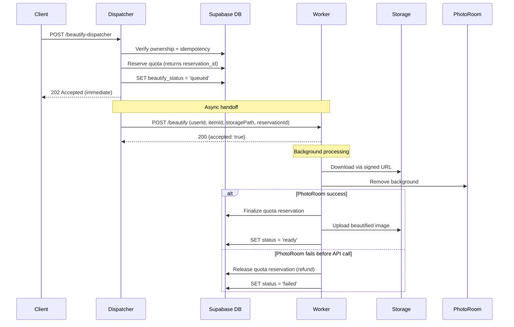

# Beautifier Async Job (v2 - Feedback Incorporated)

## Key Changes from v1

1. **Truly async dispatcher** - Returns 202 immediately, worker processes in background
2. **Secure secrets** - Worker has its own `SUPABASE_URL` + `SUPABASE_SERVICE_ROLE_KEY`, never receives them in request
3. **Storage-based downloads** - Pass `bucket` + `storagePath`, worker downloads via service role signed URL
4. **Reserve/finalize quota** - Reserve before work, finalize only if PhotoRoom called, refund on pre-paid failures
5. **Immediate status update** - Set `beautify_status = queued` in dispatcher before returning 202

---

## Architecture Flow



---

## 1. Database Migration

Create [supabase/migrations/016_beautifier.sql](supabase/migrations/016_beautifier.sql):

### Schema Changes

```sql
-- wardrobe_items columns (same as v1)
ALTER TABLE wardrobe_items 
ADD COLUMN IF NOT EXISTS beautified_image_uri TEXT,
ADD COLUMN IF NOT EXISTS beautify_status TEXT DEFAULT 'none' 
  CHECK (beautify_status IN ('none', 'queued', 'processing', 'ready', 'failed', 'reverted')),
ADD COLUMN IF NOT EXISTS beautify_source_hash TEXT,
ADD COLUMN IF NOT EXISTS beautify_storage_path TEXT,  -- NEW: store path for worker
ADD COLUMN IF NOT EXISTS beautify_error TEXT,
ADD COLUMN IF NOT EXISTS beautify_quality_score REAL,
ADD COLUMN IF NOT EXISTS beautify_method TEXT CHECK (beautify_method IN ('cutout', 'cleanup')),
ADD COLUMN IF NOT EXISTS beautify_version INT DEFAULT 1,
ADD COLUMN IF NOT EXISTS beautified_at TIMESTAMPTZ;
```

### Quota with Reservation Pattern

```sql
CREATE TABLE beautify_quotas (
  user_id UUID PRIMARY KEY REFERENCES auth.users(id) ON DELETE CASCADE,
  lifetime_used INT NOT NULL DEFAULT 0,
  daily_used INT NOT NULL DEFAULT 0,
  daily_reset_at DATE NOT NULL DEFAULT CURRENT_DATE,
  -- Reservation tracking
  pending_reservations INT NOT NULL DEFAULT 0,
  created_at TIMESTAMPTZ NOT NULL DEFAULT now()
);

-- Reserve quota (returns reservation_id or null if exceeded)
CREATE OR REPLACE FUNCTION reserve_beautify_quota(p_user_id UUID, p_is_pro BOOLEAN)
RETURNS JSONB LANGUAGE plpgsql SECURITY DEFINER AS $$
DECLARE
  v_quota beautify_quotas%ROWTYPE;
  v_limit INT;
  v_current INT;
  v_reservation_id UUID;
BEGIN
  -- Upsert + lock
  INSERT INTO beautify_quotas (user_id) VALUES (p_user_id) ON CONFLICT DO NOTHING;
  SELECT * INTO v_quota FROM beautify_quotas WHERE user_id = p_user_id FOR UPDATE;
  
  -- Reset daily if new day
  IF v_quota.daily_reset_at < CURRENT_DATE THEN
    UPDATE beautify_quotas SET daily_used = 0, daily_reset_at = CURRENT_DATE WHERE user_id = p_user_id;
    v_quota.daily_used := 0;
  END IF;
  
  v_limit := 2;
  v_current := CASE WHEN p_is_pro THEN v_quota.daily_used ELSE v_quota.lifetime_used END;
  v_current := v_current + v_quota.pending_reservations; -- Include pending
  
  IF v_current >= v_limit THEN
    RETURN jsonb_build_object('allowed', false, 'remaining', 0, 'limit', v_limit);
  END IF;
  
  -- Create reservation
  v_reservation_id := gen_random_uuid();
  UPDATE beautify_quotas SET pending_reservations = pending_reservations + 1 WHERE user_id = p_user_id;
  
  RETURN jsonb_build_object(
    'allowed', true,
    'reservation_id', v_reservation_id,
    'remaining', v_limit - v_current - 1,
    'limit', v_limit,
    'resets_at', CASE WHEN p_is_pro THEN (CURRENT_DATE + 1)::TEXT || ' 00:00 UTC' ELSE NULL END
  );
END;
$$;

-- Finalize reservation (consume quota - call when PhotoRoom was actually called)
CREATE OR REPLACE FUNCTION finalize_beautify_quota(p_user_id UUID, p_is_pro BOOLEAN)
RETURNS VOID LANGUAGE plpgsql SECURITY DEFINER AS $$
BEGIN
  UPDATE beautify_quotas SET
    pending_reservations = GREATEST(0, pending_reservations - 1),
    daily_used = CASE WHEN p_is_pro THEN daily_used + 1 ELSE daily_used END,
    lifetime_used = CASE WHEN NOT p_is_pro THEN lifetime_used + 1 ELSE lifetime_used END
  WHERE user_id = p_user_id;
END;
$$;

-- Release reservation (refund - call when failed before paid API)
CREATE OR REPLACE FUNCTION release_beautify_quota(p_user_id UUID)
RETURNS VOID LANGUAGE plpgsql SECURITY DEFINER AS $$
BEGIN
  UPDATE beautify_quotas SET pending_reservations = GREATEST(0, pending_reservations - 1) WHERE user_id = p_user_id;
END;
$$;
```

---

## 2. Edge Function Dispatcher (Truly Async)

Create [supabase/functions/beautify-dispatcher/index.ts](supabase/functions/beautify-dispatcher/index.ts):

**Key changes:**

- Returns 202 immediately after setting `queued` status
- Does NOT pass service role key to worker
- Sends `storagePath` instead of `originalUri`
```typescript
Deno.serve(async (req: Request): Promise<Response> => {
  // 1. Auth (same as v1)
  const { user, error } = await verifyJWT(req);
  if (error) return new Response(JSON.stringify({ error: 'Unauthorized' }), { status: 401 });
  
  const { itemId, storagePath, sourceHash } = await req.json();
  const serviceClient = createClient(SUPABASE_URL, SUPABASE_SERVICE_ROLE_KEY);
  
  // 2. Ownership + idempotency check
  const { data: item } = await serviceClient
    .from('wardrobe_items')
    .select('id, user_id, beautify_status, beautify_source_hash')
    .eq('id', itemId).single();
  
  if (!item || item.user_id !== user.id) {
    return new Response(JSON.stringify({ error: 'Not found' }), { status: 404 });
  }
  
  // Idempotency: already ready with same hash
  if (item.beautify_status === 'ready' && item.beautify_source_hash === sourceHash) {
    return new Response(JSON.stringify({ ok: true, source: 'idempotent_skip' }), { status: 200 });
  }
  
  // 3. RESERVE quota (not consume yet)
  const isPro = await checkUserIsPro(serviceClient, user.id);
  const { data: quotaResult } = await serviceClient.rpc('reserve_beautify_quota', {
    p_user_id: user.id, p_is_pro: isPro
  });
  
  if (!quotaResult?.allowed) {
    return new Response(JSON.stringify({
      error: 'quota_exceeded',
      message: isPro ? 'Daily limit reached (resets midnight UTC)' : 'Free limit reached',
      quota: quotaResult
    }), { status: 429 });
  }
  
  // 4. SET queued status IMMEDIATELY (for instant UI feedback)
  await serviceClient.from('wardrobe_items').update({
    beautify_status: 'queued',
    beautify_source_hash: sourceHash,
    beautify_storage_path: storagePath,
    beautify_error: null
  }).eq('id', itemId);
  
  // 5. Fire-and-forget to worker (don't await full processing)
  fetch(WORKER_URL, {
    method: 'POST',
    headers: { 'Content-Type': 'application/json', 'Authorization': `Bearer ${WORKER_SECRET}` },
    body: JSON.stringify({
      userId: user.id,
      itemId,
      storagePath,  // NOT originalUri
      sourceHash,
      isPro,
      reservationId: quotaResult.reservation_id
      // NO supabaseServiceKey!
    })
  }).catch(console.error); // Fire and forget
  
  // 6. Return 202 immediately
  return new Response(JSON.stringify({
    ok: true,
    accepted: true,
    status: 'queued'
  }), { status: 202 });
});
```


---

## 3. Worker (Fly.io) - Secure Secrets

**Key changes:**

- Worker has its own `SUPABASE_URL` and `SUPABASE_SERVICE_ROLE_KEY` as Fly secrets
- Downloads from storage using signed URL
- Finalizes/releases quota based on outcome
```typescript
// beautify-worker/src/index.ts
const SUPABASE_URL = process.env.SUPABASE_URL!;        // Set as Fly secret
const SUPABASE_SERVICE_KEY = process.env.SUPABASE_SERVICE_ROLE_KEY!; // Set as Fly secret

app.post('/beautify', async (req, res) => {
  // Immediately acknowledge (don't block dispatcher)
  res.json({ ok: true, accepted: true });
  
  // Process in background
  processJob(req.body).catch(console.error);
});

async function processJob({ userId, itemId, storagePath, sourceHash, isPro, reservationId }) {
  const supabase = createClient(SUPABASE_URL, SUPABASE_SERVICE_KEY);
  let photoRoomCalled = false;
  
  try {
    // Update status to processing
    await supabase.from('wardrobe_items')
      .update({ beautify_status: 'processing' })
      .eq('id', itemId);
    
    // Download via signed URL (not public URL)
    const { data: signedUrl } = await supabase.storage
      .from('wardrobe-images')
      .createSignedUrl(storagePath, 300); // 5 min expiry
    
    const imageResponse = await fetch(signedUrl.signedUrl);
    const imageBuffer = Buffer.from(await imageResponse.arrayBuffer());
    
    // Call PhotoRoom
    photoRoomCalled = true; // Mark before calling paid API
    const cutoutResult = await provider.removeBackground(imageBuffer);
    
    // FINALIZE quota (paid API was called)
    await supabase.rpc('finalize_beautify_quota', { p_user_id: userId, p_is_pro: isPro });
    
    // Quality checks + processing (same as v1)
    const quality = await runQualityChecks(cutoutResult);
    const finalImage = quality.pass 
      ? await composeOnBackground(cutoutResult)
      : await deterministicCleanup(imageBuffer);
    
    // Upload + update DB
    const beautifiedPath = `wardrobe_beautified/${userId}/${itemId}/${sourceHash}.jpg`;
    await supabase.storage.from('wardrobe-images').upload(beautifiedPath, finalImage, { upsert: true });
    
    await supabase.from('wardrobe_items').update({
      beautified_image_uri: `${SUPABASE_URL}/storage/v1/object/public/wardrobe-images/${beautifiedPath}`,
      beautify_status: 'ready',
      beautify_method: quality.pass ? 'cutout' : 'cleanup',
      beautify_quality_score: quality.alphaCoverage,
      beautified_at: new Date().toISOString()
    }).eq('id', itemId);
    
  } catch (error) {
    // RELEASE quota if PhotoRoom was never called (no cost incurred)
    if (!photoRoomCalled) {
      await supabase.rpc('release_beautify_quota', { p_user_id: userId });
    } else {
      // PhotoRoom was called - quota consumed even on failure
      await supabase.rpc('finalize_beautify_quota', { p_user_id: userId, p_is_pro: isPro });
    }
    
    await supabase.from('wardrobe_items').update({
      beautify_status: 'failed',
      beautify_error: error.message
    }).eq('id', itemId);
  }
}
```


### Fly.io Secrets (NOT in code)

```bash
fly secrets set SUPABASE_URL="https://xxx.supabase.co"
fly secrets set SUPABASE_SERVICE_ROLE_KEY="eyJ..."
fly secrets set WORKER_SECRET="your-secure-secret"
fly secrets set PHOTOROOM_API_KEY="your-key"
```

### Memory Considerations

```toml
# fly.toml - increase if OOM occurs
[[vm]]
  memory_mb = 1024  # Start with 1GB for Sharp safety
  
[http_service]
  concurrency = { type = "requests", soft_limit = 2, hard_limit = 4 }  # Limit concurrent jobs
```

---

## 4. UI Updates

### Preserve Existing Tile Layout

Keep current title + category badge. Add ⋯ button and Before/After toggle as overlays.

```typescript
function WardrobeGridItem({ item }: Props) {
  const hasBeautified = item.beautifyStatus === 'ready';
  const isProcessing = item.beautifyStatus === 'queued' || item.beautifyStatus === 'processing';
  
  return (
    <View className="relative">
      <Image source={{ uri: displayUri }} />
      
      {/* Existing layout preserved: title + category badge below image */}
      
      {/* NEW: Before/After pill - above title, left-aligned */}
      {hasBeautified && (
        <Pressable 
          className="absolute bottom-12 left-2 px-2 py-0.5 rounded-full"
          style={{ backgroundColor: 'rgba(0,0,0,0.35)' }}
          onPress={() => setShowOriginal(!showOriginal)}
        >
          <Text className="text-white text-[10px] font-medium">
            {showOriginal ? 'After' : 'Before'}
          </Text>
        </Pressable>
      )}
      
      {/* NEW: ⋯ overflow menu - bottom-right */}
      <Pressable 
        className="absolute items-center justify-center rounded-full"
        style={{
          right: 12,
          bottom: 12,
          width: 32,  // hit area
          height: 32,
          backgroundColor: 'rgba(255,255,255,0.22)',
          borderWidth: 1,
          borderColor: 'rgba(255,255,255,0.18)',
          shadowColor: '#000',
          shadowOpacity: 0.12,
          shadowRadius: 6,
          shadowOffset: { x: 0, y: 2 },
          elevation: 2
        }}
        onPress={() => setShowActionSheet(true)}
      >
        <View style={{ width: 28, height: 28, alignItems: 'center', justifyContent: 'center' }}>
          <MoreHorizontal size={16} color="white" />
        </View>
      </Pressable>
      
      {/* Processing overlay */}
      {isProcessing && (
        <View className="absolute inset-0 bg-black/40 items-center justify-center">
          <ActivityIndicator size="small" color="white" />
          <Text className="text-white text-xs mt-1">Enhancing...</Text>
        </View>
      )}
    </View>
  );
}
```

### Tile Layout Diagram

```
┌─────────────────────┐
│                     │
│      (image)        │
│                     │
│ [B/A pill]          │  ← Before/After pill (only when enhanced)
│─────────────────────│
│ Title          [⋯]  │  ← Title + overflow menu bottom-right
│ Category            │  ← Keep existing category badge
└─────────────────────┘
```

---

## 5. Client Queue Updates

Pass `storagePath` instead of `originalUri`:

```typescript
// src/lib/beautify-queue.ts

async function callBeautifyDispatcher(job: BeautifyJob) {
  const response = await fetch(`${SUPABASE_URL}/functions/v1/beautify-dispatcher`, {
    method: 'POST',
    headers: {
      'Content-Type': 'application/json',
      'Authorization': `Bearer ${session.access_token}`
    },
    body: JSON.stringify({
      itemId: job.itemId,
      storagePath: job.storagePath,  // e.g., "wardrobe/{userId}/{itemId}/original.jpg"
      sourceHash: job.sourceHash
    })
  });
  
  if (response.status === 202) {
    // Success - item is now queued
    return { success: true };
  }
  
  // Handle 429 quota exceeded, 404 not found, etc.
  const data = await response.json();
  throw new Error(data.error || 'Unknown error');
}
```

---

## Summary of Changes

| Issue | v1 Approach | v2 Fix |

|-------|-------------|--------|

| Dispatcher blocks | Awaits full worker response | Returns 202 immediately |

| Service key exposure | Passed in request body | Worker has own secrets |

| Public URL download | Fetches `originalUri` | Uses storage path + signed URL |

| Quota on failure | Consumed before work | Reserve/finalize pattern |

| Daily reset timezone | Implicit | Explicit "midnight UTC" in UI |

| UI layout | Replaces category badge | Preserves badge, adds overlays |

| ⋯ button placement | Bottom-left | Bottom-right (32x32 hit, 28x28 visible) |

| Before/After toggle | Bottom-left | Pill above title |

| Memory | 512MB | 1024MB (Sharp safety) |

| Concurrency | Unlimited | soft=2, hard=4 per machine |