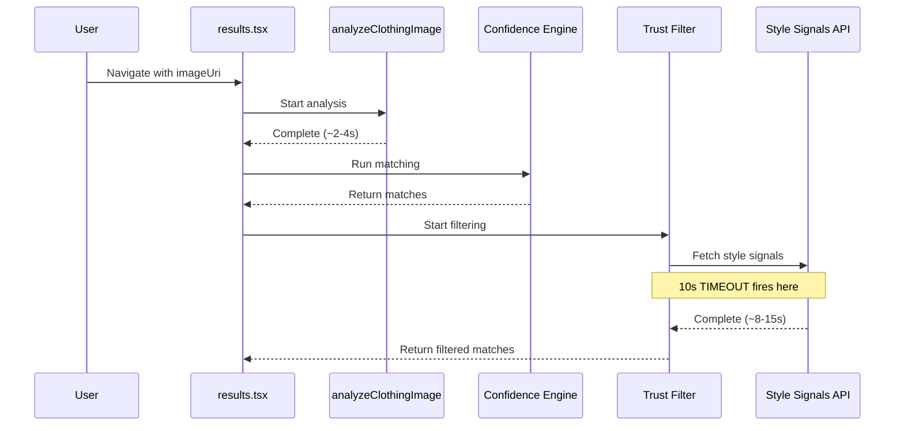
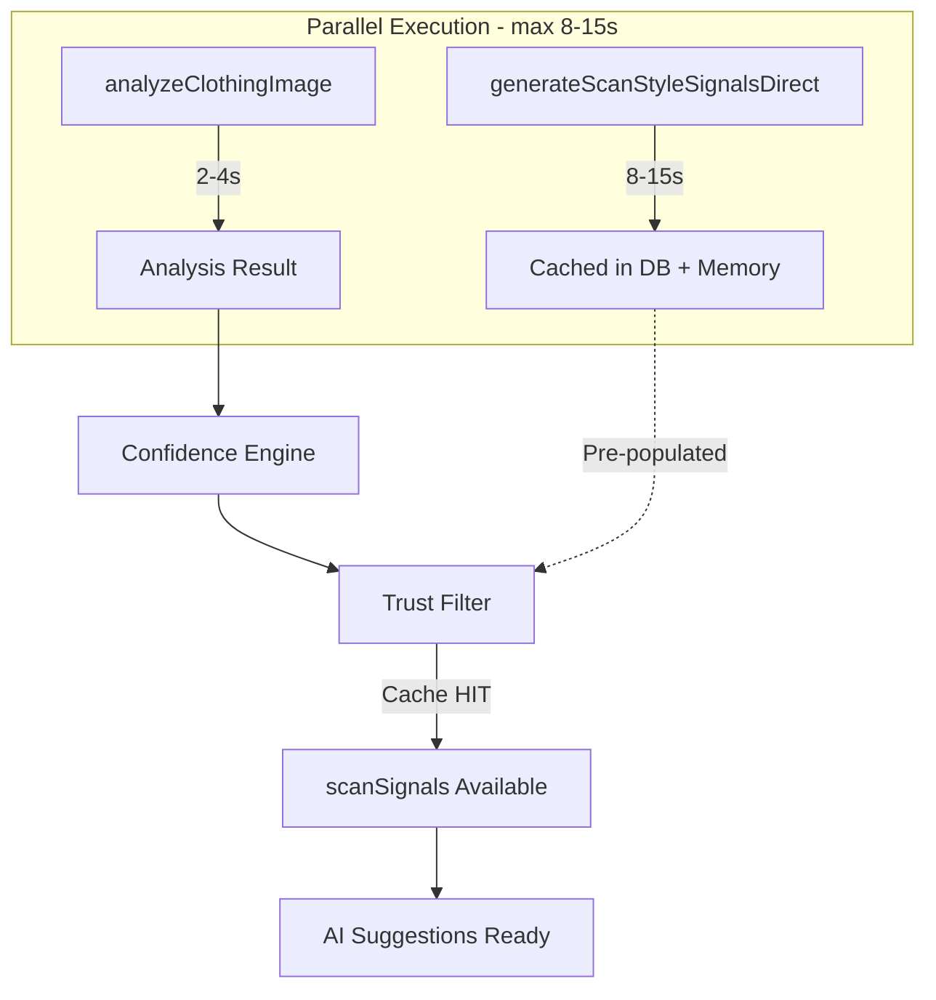

# Parallel Style Signals Optimization

## Executive Summary

This optimization reduces total scan-to-AI-suggestions time from **~27 seconds to ~17 seconds** by running style signals generation in parallel with image analysis, rather than sequentially after the Confidence Engine runs.

---

## Problem Statement

### Current Sequential Flow



**Problem:** The Style Signals API (GPT-4o Vision) takes 8-15 seconds to respond. Trust Filter has a 10-second timeout (`SIGNALS_TIMEOUT_MS`), causing it to proceed with `insufficient_info` mode before signals arrive.

**User Impact:**

- Trust Filter operates in degraded mode (can't properly filter matches)
- AI Suggestions in SOLO mode are blocked waiting for `scanSignals`
- User sees "processing" states longer than necessary

### Timeline Comparison

```
BEFORE (Sequential):                    AFTER (Parallel):
                                        
analyze-image ──────▶ 2-4s             analyze-image ──────┐
         ↓                                                 ├──▶ max(2-4s, 8-15s) = 8-15s
CE + TF start ────────────────         style-signals ──────┘
         ↓                                      ↓
style-signals ──────▶ 8-15s            CE + TF start (signals CACHED)
         ↓                                      ↓
AI suggestions ─────▶ 5-6s             AI suggestions ────▶ 5-6s
         ↓                                      ↓
TOTAL: ~27s                            TOTAL: ~17s
```

---

## Solution Architecture

### Parallel Pre-fetch Strategy

Fire style signals generation **in parallel** with image analysis at scan start:



**Key Insight:** Trust Filter calls `generateScanStyleSignalsDirect(scanImageUri)` with the same local image URI. By calling this function first in parallel, the result gets cached (Tier 0: memory, Tier 1: DB), and Trust Filter finds it instantly.

---

## Implementation Details

### File 1: [src/app/results.tsx](src/app/results.tsx)

#### Change 1: Add Import (after line 117)

**Current code (lines 116-118):**

```typescript
import { PersonalizedSuggestionsCard } from "@/components/PersonalizedSuggestionsCard";
import { fetchPersonalizedSuggestions, type SuggestionsResult } from "@/lib/personalized-suggestions-service";
import type { PersonalizedSuggestions, WardrobeSummary } from "@/lib/types";
```

**Add this import after line 117:**

```typescript
import { generateScanStyleSignalsDirect } from "@/lib/style-signals-service";
```

**After modification:**

```typescript
import { PersonalizedSuggestionsCard } from "@/components/PersonalizedSuggestionsCard";
import { fetchPersonalizedSuggestions, type SuggestionsResult } from "@/lib/personalized-suggestions-service";
import { generateScanStyleSignalsDirect } from "@/lib/style-signals-service";
import type { PersonalizedSuggestions, WardrobeSummary } from "@/lib/types";
```

#### Change 2: Modify Analysis Effect (lines 1677-1683)

**Current code:**

```typescript
(async () => {
  const result = await analyzeClothingImage({
    imageUri,
    idempotencyKey: analysisKey, // Required for server-side quota enforcement
    operationType: 'scan', // Use scan quota pool
    signal: ac.signal,
  });
  
  if (ac.signal.aborted) return;
```

**Replace with:**

```typescript
(async () => {
  // Fire both calls in parallel - style signals cached for Trust Filter
  const [analysisResult, _signalsResult] = await Promise.allSettled([
    analyzeClothingImage({
      imageUri,
      idempotencyKey: analysisKey, // Required for server-side quota enforcement
      operationType: 'scan', // Use scan quota pool
      signal: ac.signal,
    }),
    // Pre-fetch style signals (fire-and-forget, result cached in memory + DB)
    // Trust Filter will find this in cache when it runs later
    generateScanStyleSignalsDirect(imageUri, { signal: ac.signal }).catch(err => {
      if (__DEV__) {
        console.log('[Pre-fetch] Style signals failed (non-blocking):', err?.message || err);
      }
      return null;
    }),
  ]);

  // Extract analysis result (style signals are cached automatically)
  const result = analysisResult.status === 'fulfilled'
    ? analysisResult.value
    : { ok: false as const, error: { kind: 'unknown' as const, message: 'Analysis failed' } };
  
  if (ac.signal.aborted) return;
```

---

### File 2: [src/lib/style-signals-service.ts](src/lib/style-signals-service.ts)

#### Change 3: Add Abort Signal Support (lines 335-415)

**Current function signature (line 335-337):**

```typescript
export async function generateScanStyleSignalsDirect(
  localImageUri: string
): Promise<StyleSignalsResponse> {
```

**Replace with:**

```typescript
export async function generateScanStyleSignalsDirect(
  localImageUri: string,
  options?: { signal?: AbortSignal }
): Promise<StyleSignalsResponse> {
```

**Current fetch call (lines 405-415):**

```typescript
const response = await fetch(getStyleSignalsUrl(), {
  method: 'POST',
  headers: {
    Authorization: `Bearer ${token}`,
    'Content-Type': 'application/json',
  },
  body: JSON.stringify({
    type: 'scan_direct',
    imageDataUrl,
  }),
});
```

**Replace with:**

```typescript
const response = await fetch(getStyleSignalsUrl(), {
  method: 'POST',
  headers: {
    Authorization: `Bearer ${token}`,
    'Content-Type': 'application/json',
  },
  body: JSON.stringify({
    type: 'scan_direct',
    imageDataUrl,
  }),
  signal: options?.signal,
});
```

---

## How Cache Hit Works

### Trust Filter's Existing Code (useTrustFilter.ts lines 306-318)

```typescript
if (isLocalImage && scanImageUri) {
  // For local images (unsaved scans), use direct generation with base64
  const response = await generateScanStyleSignalsDirect(scanImageUri);
  // ...
}
```

### Cache Flow

1. **Pre-fetch call** (in results.tsx parallel block):

   - `generateScanStyleSignalsDirect(imageUri)` runs
   - Computes SHA256 hash of resized image
   - Checks Tier 0 (memory) → miss
   - Checks Tier 1 (DB) → miss
   - Calls Style Signals API → takes 8-15s
   - Caches result in both Tier 0 and Tier 1

2. **Trust Filter call** (in useTrustFilter.ts):

   - `generateScanStyleSignalsDirect(scanImageUri)` runs with SAME URI
   - Computes SHA256 hash → SAME hash
   - Checks Tier 0 (memory) → **HIT** (if still in memory)
   - Or checks Tier 1 (DB) → **HIT**
   - Returns instantly without API call

---

## Key Behaviors

| Behavior | Description |

|----------|-------------|

| **Fire-and-forget** | Style signals call doesn't block analysis completion |

| **Fail-open** | If pre-fetch fails, Trust Filter retries as before |

| **Cache warming** | Signals cached by image hash, ready for Trust Filter |

| **No timeout impact** | Trust Filter finds cached signals instantly |

| **Abortable** | Both calls cancel cleanly when user navigates away |

| **Same API calls** | No additional API calls - just parallelized |

---

## Risks and Mitigations

### Risk 1: Cache Key Mismatch (Medium Severity, Low Likelihood)

**Problem:** If pre-fetch and Trust Filter compute different hashes (different image processing), cache won't hit.

**Why it won't happen:**

- Both use exact same function: `generateScanStyleSignalsDirect(imageUri)`
- Same URI → same `resizeAndCompressImage()` → same bytes → same SHA256

**Mitigation:** Verify in testing by checking logs for:

```
[StyleSignals] Memory cache hit (Tier 0)
```

---

### Risk 2: Abort Signal Not Propagated (Medium Severity, Medium Likelihood)

**Problem:** Without abort signal, style signals continues in background if user navigates away.

**Solution:** Pass `ac.signal` to `generateScanStyleSignalsDirect` (implemented in Step 3).

**Verification:** Start scan, immediately press back, check logs for:

```
[Pre-fetch] Style signals failed (non-blocking): AbortError
```

---

### Risk 3: Double Memory Pressure (Low-Medium Severity, Low Likelihood)

**Problem:** Two image operations in parallel:

- `analyzeClothingImage`: Resizes to 768px, base64
- `generateScanStyleSignalsDirect`: Resizes to 512px, base64

**Mitigation:**

- `Promise.allSettled` ensures one failure doesn't crash both
- Memory released after each completes
- Monitor older devices (iPhone 8, 6s) for memory warnings

---

### Risk 4: Rate Limiting (Low Severity, Low Likelihood)

**Problem:** Style signals has rate limits (10 burst / 5min, 30 / hour).

**Why it's acceptable:**

- Same number of API calls as before (just parallel)
- Rate limits are per-user
- Natural scan frequency throttles usage

---

### Risk 5: Timing Edge Case (Low Severity, Medium Likelihood)

**Scenario:**

1. Pre-fetch starts
2. Analysis completes fast (cache hit, ~500ms)
3. Trust Filter starts, signals still in-flight
4. TF timeout fires (10s)
5. Signals complete and cache

**Impact:** First scan of new item still times out.

**Why it's acceptable:**

- Not worse than current behavior
- Subsequent scans benefit from cache
- Could increase TF timeout to 15s later

---

### Risk 6: Error Masking (Low Severity, Low Likelihood)

**Problem:** `.catch()` silently swallows errors.

**Mitigation:**

- Errors logged in `__DEV__` mode
- Trust Filter fallback works (`insufficient_info`)
- Can add telemetry later if needed

---

### Risk 7: Increased API Costs (None)

**Clarification:** Same number of API calls:

- 1x GPT-4o Vision for analyze-image
- 1x GPT-4o Vision for style-signals

Change is **parallel vs sequential**, not additional calls.

---

## Risk Summary Table

| Risk | Severity | Likelihood | Code Required |

|------|----------|------------|---------------|

| Cache key mismatch | Medium | Low | Debug logging |

| Abort signal | Medium | Medium | Yes (Step 3) |

| Memory pressure | Low-Medium | Low | Monitor only |

| Rate limiting | Low | Low | None |

| Timing edge case | Low | Medium | None |

| Error masking | Low | Low | Debug logging |

| Cost increase | None | N/A | None |

---

## Testing Plan

### Test 1: Verify Parallel Execution

**Steps:**

1. Clear app cache (fresh state)
2. Scan a new item (never scanned before)
3. Watch logs

**Expected logs (interleaved):**

```
[Analysis] Starting...
[StyleSignals] Calling API (125KB, hash a1b2c3d4)...
[Analysis] Complete (2.1s)
[StyleSignals] API response received
[TF] Direct generation: SUCCESS
```

**Pass criteria:** Both operations start nearly simultaneously.

---

### Test 2: Verify Cache Hit

**Steps:**

1. Complete Test 1 (first scan)
2. Press back, re-scan same item
3. Watch logs

**Expected logs:**

```
[StyleSignals] Memory cache hit (Tier 0)
```

OR

```
[StyleSignals] DB cache hit
```

**Pass criteria:** No `Calling API` log on second scan.

---

### Test 3: Verify Trust Filter Cache Hit

**Steps:**

1. Scan a new item
2. Wait for results to display
3. Check Trust Filter logs

**Expected logs (NO timeout):**

```
[TF] Image: LOCAL (file:///...)
[TF] Direct generation: SUCCESS
```

**Pass criteria:** No `[TF] Timeout reached (10000ms)` message.

---

### Test 4: Verify Abort Handling

**Steps:**

1. Start a scan
2. Immediately press back button
3. Check logs

**Expected logs:**

```
[Pre-fetch] Style signals failed (non-blocking): AbortError
```

**Pass criteria:** No orphaned requests continue after navigation.

---

### Test 5: Verify Graceful Failure

**Steps:**

1. Enable airplane mode
2. Start a scan
3. Check behavior

**Expected behavior:**

- Style signals fails silently (logged in dev)
- Analysis fails with network error
- App shows error state (not crash)

**Pass criteria:** No crash, graceful error handling.

---

### Test 6: Performance Timing Comparison

**Before implementation:**

- Scan → Analysis (2-4s) → CE → TF timeout (10s) → Total: ~12-14s to matches

**After implementation:**

- Scan → Analysis (2-4s) + Signals (parallel, cached) → CE → TF cache hit → Total: ~2-4s to matches

**Pass criteria:** At least 8-10 seconds improvement in total time.

---

## Files Modified Summary

| File | Line(s) | Change |

|------|---------|--------|

| [src/app/results.tsx](src/app/results.tsx) | 117-118 | Add import |

| [src/app/results.tsx](src/app/results.tsx) | 1677-1683 | Parallel Promise.allSettled |

| [src/lib/style-signals-service.ts](src/lib/style-signals-service.ts) | 335-337 | Add options parameter |

| [src/lib/style-signals-service.ts](src/lib/style-signals-service.ts) | 405-415 | Pass signal to fetch |

---

## Rollback Plan

If issues arise, revert by:

1. Remove `generateScanStyleSignalsDirect` import from results.tsx
2. Restore original `analyzeClothingImage` call (remove Promise.allSettled wrapper)
3. Optionally keep abort signal support in style-signals-service.ts (harmless)

**No database migrations or schema changes** - fully reversible code change.

---

## Expected Outcome

| Metric | Before | After | Improvement |

|--------|--------|-------|-------------|

| Time to matches display | ~12-14s | ~2-4s | **8-10s faster** |

| Trust Filter timeout | Frequent | Rare | Eliminated for cached items |

| AI Suggestions ready | ~27s | ~17s | **10s faster** |

| API call count | 2 | 2 | No change |

| API cost | $X | $X | No change |

---

## Post-Implementation Monitoring

After deployment, monitor:

1. **Trust Filter timeout rate** - Should drop significantly
2. **Style signals cache hit rate** - Should increase
3. **Memory usage on older devices** - Watch for warnings
4. **Error rate in style signals pre-fetch** - Should be rare

---

## Future Enhancements (Out of Scope)

1. Increase `SIGNALS_TIMEOUT_MS` from 10s to 15s for edge cases
2. Add production telemetry for pre-fetch failures
3. Consider pre-fetching signals during camera capture (before navigation)