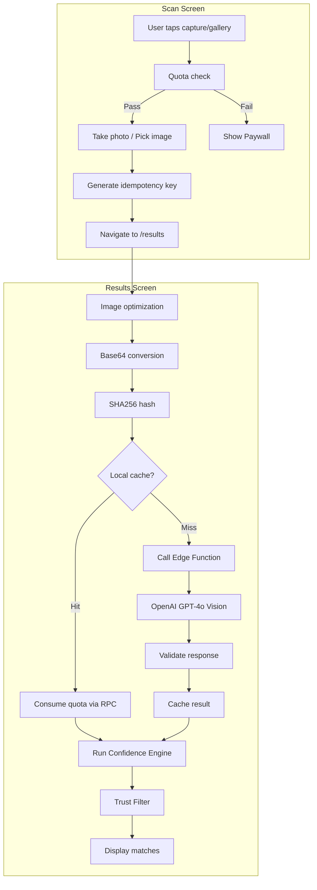
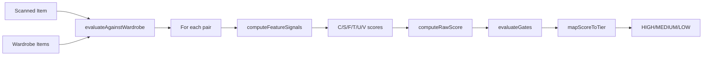

# Scan Item Workflow Analysis

## Architecture Overview

The scan workflow is a multi-stage pipeline that captures images, analyzes them via AI, and matches against the user's wardrobe.



---

## Stage-by-Stage Breakdown

### Stage 1: Image Capture ([scan.tsx](src/app/scan.tsx))

**Key operations:**

- Camera permission handling
- Quota validation before capture (free tier limits)
- Photo capture at 0.8 quality
- Gallery picker support

**Performance characteristics:**

- Camera capture: ~50-200ms (device-dependent)
- Navigation is immediate after capture (processing deferred)

---

### Stage 2: Image Processing ([openai.ts](src/lib/openai.ts))

| Operation | Typical Duration | Notes |

|-----------|-----------------|-------|

| Image optimization | 100-300ms | Resize to 768px, compress to 75% JPEG |

| Base64 conversion | 50-150ms | Platform-dependent (web vs native) |

| SHA256 hash | 10-50ms | For cache key generation |

| Cache lookup | 20-100ms | Supabase query |

| **Total (cache hit)** | **~200-500ms** | Quota RPC adds ~50-100ms |

**Code reference - image optimization:**

```257:285:src/lib/openai.ts
async function optimizeImageForApi(imageUri: string): Promise<string> {
  const result = await ImageManipulator.manipulateAsync(
    imageUri,
    [{ resize: { width: MAX_IMAGE_WIDTH } }], // MAX_IMAGE_WIDTH = 768
    { compress: IMAGE_COMPRESSION_QUALITY, format: SaveFormat.JPEG } // 0.75
  );
  return result.uri;
}
```

---

### Stage 3: AI Analysis ([analyze-image Edge Function](supabase/functions/analyze-image/index.ts))

**Performance characteristics:**

| Operation | Typical Duration | Notes |

|-----------|-----------------|-------|

| Auth validation | ~10ms | JWT verification |

| Rate limit check | ~1ms | In-memory |

| Quota consumption | ~50-100ms | Database RPC |

| **OpenAI API call** | **1500-4000ms** | GPT-4o Vision - main bottleneck |

| Response parsing | ~5ms | JSON parse + validation |

**Rate limits:**

- Per-user: 50 requests/hour
- Global: 100 requests/minute

**OpenAI call configuration:**

```352:372:supabase/functions/analyze-image/index.ts
const openaiResponse = await fetch("https://api.openai.com/v1/chat/completions", {
  method: "POST",
  headers: {
    "Authorization": `Bearer ${OPENAI_API_KEY}`,
    "Content-Type": "application/json",
  },
  body: JSON.stringify({
    model: "gpt-4o",
    messages: [{ role: "user", content: [...] }],
    max_tokens: 800,
    temperature: 0,  // Deterministic output
  }),
});
```

---

### Stage 4: Confidence Engine ([confidence-engine/](src/lib/confidence-engine/))

**Processing model:** Pure deterministic scoring (no AI, runs client-side)

**Performance characteristics:**

- Pair evaluation: ~0.1-0.5ms per pair
- 100-item wardrobe: ~10-50ms total
- Fully memoized via `useMemo`

**Scoring pipeline:**



**Feature signals:**

- **C** - Color compatibility
- **S** - Style alignment
- **F** - Formality match
- **T** - Texture compatibility
- **U** - Usage context
- **V** - Silhouette/volume balance

---

### Stage 5: Trust Filter + AI Safety ([useTrustFilter.ts](src/lib/useTrustFilter.ts))

**Post-processing pipeline:**

1. Fetch style signals for scanned item + wardrobe (cached in DB)
2. Batch-evaluate HIGH matches through Trust Filter
3. Optional AI Safety check on risky pairs

**Performance:**

- Style signals fetch: 100-500ms (DB query, cached)
- Trust Filter evaluation: ~5-20ms
- AI Safety (when enabled): ~500-1500ms (additional API call)

---

## Performance Bottlenecks

### Primary Bottleneck: OpenAI API Call (1.5-4s)

The OpenAI Vision API call dominates total latency:

- **Cache hit path:** ~200-500ms total
- **Cache miss path:** ~2000-5000ms total

**Current mitigations:**

- Content-addressed caching (SHA256 hash)
- Connection prewarming on scan screen mount
- 45-second timeout with abort controller

### Secondary Bottleneck: Image Processing (~300-500ms)

Client-side image processing before API call:

- Image optimization (resize/compress)
- Base64 conversion
- SHA256 hash computation

---

## Caching Strategy

### Layer 1: Local Analysis Cache

**Location:** Supabase `clothing_image_analysis_cache` table

**Key format:** `v{version}:{model}:{promptVersion}:{sha256}`

**Benefits:**

- Cross-device consistency
- Automatic invalidation on model/prompt changes
- Hit count tracking for analytics

### Layer 2: Style Signals Cache

**Location:** Multi-tier (memory + database)

- Tier 0: In-memory (5-minute TTL, max 50 entries)
- Tier 1: Database (persistent)

### Layer 3: React Query Caching

- Wardrobe: 2s staleTime
- Preferences: Default staleTime
- Prevents flash during cache invalidation

---

## Telemetry & Monitoring

**Key metrics tracked:**

- `analysis_duration_ms` - Total analysis time
- `cache_hit` - Cache hit rate
- `context_sufficient` - Image quality assessment
- Image dimensions, category, source
- Tier distribution in Confidence Engine

**Telemetry buffer:** Max 20 events, flushes every 30 seconds

---

## Optimization Opportunities

1. **Image preprocessing parallelization**

   - Base64 conversion and hash computation could run in parallel
   - Currently sequential: ~100ms savings possible

2. **Streaming responses**

   - OpenAI supports streaming; could show partial results faster
   - Current implementation waits for complete response

3. **Predictive caching**

   - Pre-analyze gallery images in background
   - Cache warming for frequently scanned item types

4. **Edge function cold start**

   - Current: ~200-500ms on cold start
   - Could use connection prewarming similar to client-side

5. **Confidence Engine optimization**

   - Already well-optimized (~10-50ms for 100 items)
   - Could use Web Workers for very large wardrobes

---

## Key Files Reference

| Component | File |

|-----------|------|

| Scan screen | [src/app/scan.tsx](src/app/scan.tsx) |

| Results screen | [src/app/results.tsx](src/app/results.tsx) |

| OpenAI client | [src/lib/openai.ts](src/lib/openai.ts) |

| Edge Function | [supabase/functions/analyze-image/index.ts](supabase/functions/analyze-image/index.ts) |

| Confidence Engine | [src/lib/confidence-engine/](src/lib/confidence-engine/) |

| Trust Filter | [src/lib/useTrustFilter.ts](src/lib/useTrustFilter.ts) |

| Telemetry | [src/lib/analysis-telemetry.ts](src/lib/analysis-telemetry.ts) |

| Analysis cache | [src/lib/analysis-cache.ts](src/lib/analysis-cache.ts) |