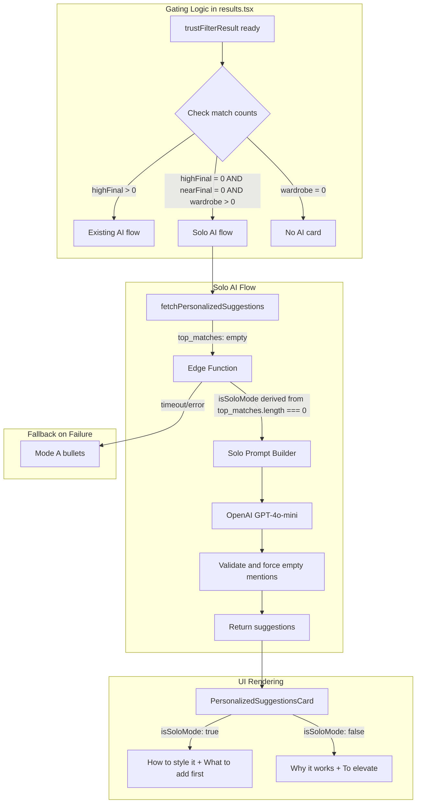

**IMPLEMENTATION STATUS: ✅ COMPLETE**

All tasks have been verified as implemented in the codebase (verified on 2026-01-29).
See `docs/handoff/personalized-suggestions-COMPLETE.md` for comprehensive documentation.

# Solo AI Styling Card Implementation

## Problem Statement

When users scan an item and get 0 HIGH + 0 NEAR matches (but have wardrobe items), the screen feels empty and disappointing. This feature adds an AI styling card that:

- Provides "How to style it" guidance personalized to their wardrobe aesthetics
- Suggests "What to add first" using the existing `consider_adding` schema
- Turns the "no matches" moment into actionable next steps

## Architecture Overview



## Critical Design Decisions

### 1. Solo Mode is Derived, Not User-Provided

**Rule:** `isSoloMode = top_matches.length === 0`

Do NOT rely on a `has_pairings` boolean from the request body for logic decisions. Derive mode from data:

- Eliminates accidental mismatch (client says `has_pairings=false` but passes `top_matches`)
- Single source of truth
- `has_pairings` may be accepted for telemetry/debug but is ignored for decisions

### 2. Solo Gating Depends on Finalized + Wardrobe Summary Ready

Solo fetch only runs when:

```typescript
trustFilterResult.isFullyReady &&  // matches finalized
wardrobeSummary?.updated_at        // wardrobe summary ready (needed for stable cache key)
```

Why: Prevents unstable cache keys or premature AI calls.

### 3. Cache Key Must Include Mode + Context

Cache key format:

```
${scanId}|${topIds}|${wardrobeUpdatedAt}|${promptVersion}|${schemaVersion}|mode:${mode}|scanCat:${scanCategory ?? 'null'}|preferAddOns:${preferAddOnCategories ? 1 : 0}
```

Where:

- `mode` = `"solo"` if `topIds === ""`, else `"paired"`
- `scanCategory` affects filtering/backfill
- `preferAddOnCategories` changes output via backfill rules
- `wardrobeUpdatedAt` must be valid ISO for cache stability

### 4. UI Placement for Solo Card

Render solo AI card **after Verdict card, above add-ons strip** because:

- It's the primary "save" moment when no matches exist
- Avoids layout surprises if tabs aren't rendered
- Clear visual hierarchy: Verdict → Styling guidance → Add-ons

### 5. Solo Mode Never Shows Blank

**Rule:** Always show either AI card (loading/ok) OR Mode A fallback.

```typescript
// NOT this (can show blank if AI fails quickly):
isSoloMode && (suggestionsLoading || suggestionsResult?.ok)

// THIS (never blank):
isSoloMode && (
  (suggestionsLoading || suggestionsResult?.ok) ||  // AI card
  (!suggestionsLoading && !suggestionsResult?.ok && helpfulAdditionRows.length > 0)  // Mode A fallback
)
```

### 6. Edge Function Auth: Two-Client Pattern

- **authClient** (anon key + bearer token) → `getUser()` → derives `userId`
- **serviceClient** (service role) → DB writes only

User identity comes from authed client, NEVER from service role or request body.

### 7. Suspicious Phrase Detection is Fail-Open

- Dev-only: log warning if text contains "with your", "your [item]"
- Production: remain fail-open (don't sanitize text)
- If sanitization ever needed: replace entire bullet with fallback, don't edit model text

## Changes by File

### 1. Edge Function: [supabase/functions/personalized-suggestions/index.ts](supabase/functions/personalized-suggestions/index.ts)

**Request Schema Update:**

- Allow `top_matches: []` (currently requires 1-5 items at line 361)
- Accept optional `has_pairings?: boolean` for telemetry only (ignored for logic)

**Mode Derivation (Critical):**

```typescript
const isSoloMode = top_matches.length === 0;
```

**Auth Pattern (Two-Client - Carry Forward):**

Maintain existing security pattern:

```typescript
// authClient (anon key + bearer token) → verify user identity
const authClient = createClient(supabaseUrl, supabaseAnonKey, {
  global: { headers: { Authorization: `Bearer ${token}` } },
});
const { data: { user } } = await authClient.auth.getUser();
const userId = user.id;  // User identity from authed client, NOT service role

// serviceClient (service role) → DB writes only
const serviceClient = createClient(supabaseUrl, supabaseServiceKey);
await serviceClient.from('personalized_suggestions_cache').upsert({ user_id: userId, ... });
```

**New Solo Prompt Builder:**

Add `buildSoloPrompt()` with explicit rules:

- Focus on styling the scanned item standalone
- Use `wardrobe_summary.dominant_aesthetics` for personalization
- **Explicit prompt rules (hardened for solo):**
  - "Do not imply the user owns any specific item"
  - "Do not say 'with your ...' or reference wardrobe item names"
  - "Output empty mentions array for all bullets"
  - "Focus on how to style this item, not what it pairs with"

**Validation Changes (Solo Mode):**

When `isSoloMode === true`:

- Strip ALL mentions from response (even if model returns them)
- **Suspicious phrase detection (dev-only, fail-open):**
  - Log warning if text contains "with your", "your [item]"
  - Do NOT sanitize text in production - keep fail-open behavior
  - If sanitization needed later, replace entire bullet with fallback (don't edit model text)
- Keep existing 2+2 bullet structure and repair strategy

**Key code location (line 118):**

```118:123:supabase/functions/personalized-suggestions/index.ts
function buildPrompt(
  scanSignals: StyleSignalsV1,
  topMatches: SafeMatchInfo[],
  wardrobeSummary: WardrobeSummary,
  intent: 'shopping' | 'own_item'
): string {
```

Add new `buildSoloPrompt()` function alongside existing `buildPrompt()`.

### 2. Client Service: [src/lib/personalized-suggestions-service.ts](src/lib/personalized-suggestions-service.ts)

**Function Signature Update:**

- Allow empty `highFinal` array (remove early return when length === 0)

**Cache Key Update (Critical):**

New cache key format with all context that affects output:

```typescript
const mode = topMatches.length === 0 ? 'solo' : 'paired';
const rawKey = [
  scanId,
  topIds,  // empty string for solo mode
  wardrobeSummary.updated_at,
  PROMPT_VERSION,
  SCHEMA_VERSION,
  `mode:${mode}`,
  `scanCat:${scanCategory ?? 'null'}`,
  `preferAddOns:${preferAddOnCategories ? 1 : 0}`,
].join('|');
```

**Why each field matters:**

- `mode`: solo vs paired use different prompts
- `scanCat`: affects filtering/backfill of to_elevate
- `preferAddOns`: changes bullet selection via add-on preference rules

**Key code location (lines 155-173):**

```155:173:src/lib/personalized-suggestions-service.ts
export async function fetchPersonalizedSuggestions({
  scanId,
  scanSignals,
  highFinal,
  wardrobeSummary,
  intent,
  scanCategory,
  preferAddOnCategories,
  addOnCategories,
}: {
  scanId: string;
  scanSignals: StyleSignalsV1;
  highFinal: EnrichedMatch[];
  wardrobeSummary: WardrobeSummary;
  intent: "shopping" | "own_item";
  scanCategory?: Category | null;
  preferAddOnCategories?: boolean;
  addOnCategories?: AddOnCategory[];
}): Promise<SuggestionsResult> {
```

### 3. UI Component: [src/components/PersonalizedSuggestionsCard.tsx](src/components/PersonalizedSuggestionsCard.tsx)

**Props Update:**

- Add `isSoloMode?: boolean` prop

**Section Title Mapping:**

- `isSoloMode=true`: "How to style it" / "What to add first"
- `isSoloMode=false`: "Why it works" / "To elevate"

**Existing behavior already handles empty mentions:**

```116:126:src/components/PersonalizedSuggestionsCard.tsx
        {/* Owned item references (rendered separately, not string-replaced) */}
        {mentionedItems.length > 0 && (
          <Text
            style={{
              ...typography.ui.caption,
              color: colors.text.secondary,
              marginTop: spacing.xs / 2,
            }}
          >
            (with your {formatItemList(mentionedItems)})
          </Text>
        )}
```

### 4. Results Screen: [src/app/results.tsx](src/app/results.tsx)

**New Gating Logic (around line 2304):**

```typescript
// CRITICAL: Solo fetch only after matches finalized + wardrobeSummary ready
// wardrobeSummary.updated_at must be valid ISO for stable cache key
const canFetchSoloAi =
  trustFilterResult.isFullyReady &&           // matches finalized
  wardrobeSummary?.updated_at &&              // wardrobe summary ready (needed for stable cache key)
  wardrobeCount > 0 &&
  trustFilterResult.finalized.highFinal.length === 0 &&
  trustFilterResult.finalized.nearFinal.length === 0;

// Derive mode for passing to components
const isSoloMode = canFetchSoloAi;
```

**Modified useEffect (lines 2293-2358):**

- Current: exits early if `highFinal.length === 0`
- New: also trigger for solo mode with different parameters
- Pass `top_matches: []` when solo mode
- **Gate:** Only run when `trustFilterResult.isFullyReady && wardrobeSummary?.updated_at`

**Add-ons Preference (Explicit):**

```typescript
// preferAddOnCategories only true if strip actually exists AND has categories
const preferAddOnCategories = 
  showAddOnsStrip && 
  addOnCategoriesForSuggestions.length > 0;
```

**Rendering Placement (Critical):**

Solo card renders **after Verdict card, above add-ons strip**.

**CRITICAL: Solo mode never shows blank** - always show either AI card OR Mode A fallback:

```tsx
{/* Verdict Card */}
{renderVerdictCard()}

{/* Solo AI Card OR Mode A Fallback - NEVER blank */}
{isSoloMode && (
  <>
    {/* Show AI card while loading or on success */}
    {(suggestionsLoading || suggestionsResult?.ok) && (
      <Animated.View entering={FadeIn.delay(400)} style={{ marginBottom: spacing.md }}>
        <PersonalizedSuggestionsCard
          suggestions={suggestionsResult?.ok ? suggestionsResult.data : null}
          isLoading={suggestionsLoading}
          wardrobeItemsById={wardrobeItemsById}
          isSoloMode={true}
        />
      </Animated.View>
    )}
    
    {/* Mode A fallback when AI failed/timed out (not loading, not ok) */}
    {!suggestionsLoading && !suggestionsResult?.ok && helpfulAdditionRows.length > 0 && (
      <Animated.View entering={FadeInDown.delay(350)} style={{ marginBottom: spacing.md }}>
        {/* Render Mode A bullets as fallback */}
        {renderModeASection()}
      </Animated.View>
    )}
  </>
)}

{/* Add-ons Strip */}
{showAddOnsStrip && renderAddOnsStrip()}
```

**Mode A Fallback Logic:**

- Solo mode: Mode A shown only if AI fails/times out (never blank)
- Paired mode: Keep existing suppression logic (Mode A hidden while AI loading/present on HIGH tab)

## Key Validation Rules for Solo Mode

1. **Force empty mentions:** Strip ALL `why_it_works[].mentions`, even if model returns them
2. **Suspicious phrase detection (dev-only, fail-open):**

   - Log warning if text contains "with your", "your [item]"
   - Do NOT sanitize text in production - remain fail-open
   - If sanitization ever needed: replace entire bullet with fallback (don't edit model text)

3. **Output shape:** Always 2+2 bullets via repair strategy
4. **Personalization:** Use `wardrobe_summary.dominant_aesthetics` to match user's style

## Filter Ordering for `to_elevate` (Deterministic)

**Order matters to avoid edge cases where diversity picks a category that later gets removed:**

```
1. Start from model bullets (raw AI output)
2. Apply scanCategory removal (remove recommend.category === scanCategory)
3. Apply preferAddOnCategories (soft - keep add-on bullets if available)
4. Enforce diversity (no duplicate categories)
5. Backfill to exactly 2 bullets (using fallback order)
```

This order ensures:

- Scan-category filter runs first (blocks same-category recommendations)
- Add-on preference runs on filtered set
- Diversity check runs on preference-filtered set
- Backfill only adds categories not already blocked/used

## Solo Mode Prompt Structure

The prompt should:

- Receive `scan_signals` (scanned item's style signals)
- Receive `wardrobe_summary` (counts + dominant aesthetics)
- Receive `top_matches: []` (empty array)
- Generate styling advice that matches wardrobe aesthetics

**Explicit prompt rules (hardened):**

- "Do not imply the user owns any specific item"
- "Do not say 'with your ...' or similar ownership language"
- "Do not reference wardrobe item names or labels"
- "Output empty mentions array for all why_it_works bullets"

Example prompt context:

```
intent: own_item
scan: aesthetic:minimalist; formality:casual; ...
wardrobe: total:15; categories:tops:5,bottoms:4,...; aesthetics:minimalist/classic
top_matches: [] (solo mode - no pairings)
```

## Test Coverage

### Unit Tests

- `validateAndRepairSuggestions` with empty `validIds` (solo mode)
- Solo mode forces empty mentions (even if model returns them)
- Scan-category filter in solo mode
- Cache key generation includes mode/scanCat/preferAddOns

### Integration Tests

- Solo AI fetch when 0 matches + wardrobe > 0
- UI: Correct section titles in solo mode ("How to style it" / "What to add first")

### Nasty Edge Case Test (Critical)

This test catches regressions in the filter ordering:

```typescript
describe('Solo mode edge case: scanCategory + preferAddOns + diversity', () => {
  it('handles shoes scanCategory with single add-on preference', () => {
    // Setup:
    // - Solo mode (top_matches: [])
    // - scanCategory = 'shoes'
    // - preferAddOnCategories = true (add-ons exist)
    // - Model outputs: ['shoes', 'outerwear'] for to_elevate
    
    // Expected:
    // 1. shoes removed (scan filter)
    // 2. outerwear kept (add-on category)
    // 3. If only one add-on category remains, bullet2 uses core-shortlist
    //    → tops (since shoes is blocked by scanCategory)
    // 4. Final: ['outerwear', 'tops'], no duplicates
    
    const result = validateAndRepairSuggestions(
      { to_elevate: [
        { recommend: { category: 'shoes' } },
        { recommend: { category: 'outerwear' } },
      ]},
      [], // empty validIds = solo mode
      'shoes', // scanCategory
      true, // preferAddOnCategories
      ['outerwear'], // single add-on category
    );
    
    expect(result.suggestions.to_elevate[0].recommend.category).toBe('outerwear');
    expect(result.suggestions.to_elevate[1].recommend.category).toBe('tops');
    expect(result.suggestions.to_elevate.length).toBe(2);
  });
});
```

## Telemetry

Extend existing events with full context:

**`personalized_suggestions_started`:**

- `is_solo_mode: boolean`
- `scan_category: string | null`
- `prefer_add_on_categories: boolean`

**`personalized_suggestions_completed`:**

- `is_solo_mode: boolean`
- `source: 'cache_hit' | 'ai_call'`
- `was_repaired: boolean`
- `removed_by_scan_category_count: number`
- `applied_add_on_preference: boolean`

These fields are critical for tuning prompt effectiveness and filter behavior.

## Rollback Strategy

- Edge Function: Mode is derived from `top_matches.length`, no breaking changes
- Client: Solo gating is additive, doesn't affect existing paired flow
- UI: `isSoloMode` defaults to `false`, preserves existing behavior
- Cache: New cache keys don't collide with old (includes `mode:` prefix)

---

## Merge Checklist

### CRITICAL (must pass before merging)

- [ ] `isSoloMode` derived ONLY from `top_matches.length === 0` (not from request body boolean)
- [ ] Results gating: solo fetch only after `trustFilterResult.isFullyReady` + `wardrobeSummary.updated_at` exists
- [ ] Edge function auth: authed client (anon key + bearer) derives user; service client writes
- [ ] Cache key includes `mode:solo|paired`, `scanCat`, `preferAddOns` (stable ISO timestamp)
- [ ] Solo validation: mentions stripped unconditionally; never implies ownership
- [ ] Solo UI never blank: AI card (loading/ok) OR Mode A fallback always shown
- [ ] Filter ordering implemented exactly: scanCat removal → preferAddOns → diversity → backfill

### Non-Critical (still important)

- [ ] Telemetry includes `is_solo_mode` + `source` + `was_repaired` + `removed_by_scan_category_count` + `applied_add_on_preference`
- [ ] Nasty edge-case test added & green (scanCategory=shoes + preferAddOns + single add-on)
- [ ] Solo card placement: after Verdict, before add-ons strip
- [ ] Add-ons preference only true if `showAddOnsStrip && addOnCategoriesForSuggestions.length > 0`
- [ ] Suspicious phrase detection: dev-only logs, production remains fail-open