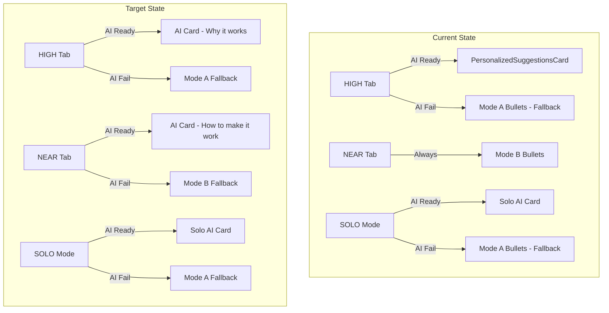
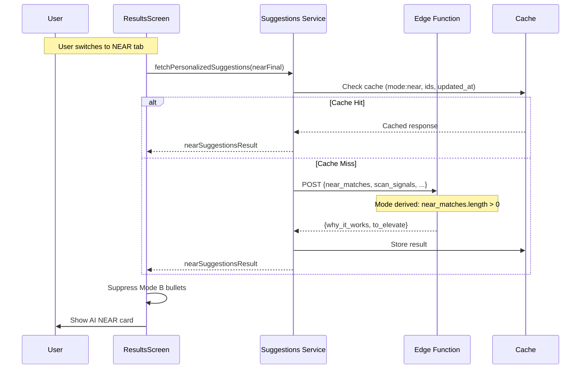

# Unified AI Styling Suggestions Plan

## Current State Analysis

### What Exists

- **Mode A bullets**: Static suggestions on HIGH tab (already suppressed when AI present)
- **Mode B bullets**: Static styling tips on NEAR tab (NOT suppressed, NO AI integration)
- **AI suggestions**: Only work on HIGH tab and SOLO mode via `PersonalizedSuggestionsCard`

### Gap to Fill

The NEAR tab still uses deterministic Mode B bullets with no AI personalization. Need to:

1. Add AI endpoint support for NEAR mode
2. Add client-side fetch for NEAR tab
3. Suppress Mode B when AI loading/present on NEAR tab

### Bug to Fix: Solo Mode with 0 Total Matches

**Root Cause:** In [src/lib/useTrustFilter.ts](src/lib/useTrustFilter.ts) lines 274-277:

```typescript
// Skip if no matches to filter
if (confidenceResult.matches.length === 0) {
  return;  // <-- This skips signal fetching entirely!
}
```

When there are 0 total matches (no core + no add-on matches), this condition prevents `scanSignals` from being fetched. Since the AI suggestions fetch in results.tsx requires `scanSignals`, solo mode AI never triggers.

**Why it works with add-on matches:** Add-on matches count toward `matches.length`, so the condition passes and signals get fetched.

**Fix:** Remove this early return or modify it to still fetch scan signals (needed for solo mode AI) while optionally skipping wardrobe signals fetching.

---

## Architecture Overview



---

## Implementation Details

### 0. Bug Fix: Solo Mode with 0 Total Matches (PRIORITY)

**File:** [src/lib/useTrustFilter.ts](src/lib/useTrustFilter.ts)

**Current code (lines 274-277):**

```typescript
// Skip if no matches to filter
if (confidenceResult.matches.length === 0) {
  return;
}
```

**Fix:** Remove this early return. The signal fetching should always run when Trust Filter is enabled because:

1. Solo mode needs `scanSignals` for AI suggestions
2. Wardrobe signals fetching (line 336) already has its own guard: `if (matchedItemIds.length > 0)`

**Change to:**

```typescript
// Note: Don't skip when matches.length === 0
// Solo mode needs scanSignals even with 0 matches
// Wardrobe signals fetching has its own guard (matchedItemIds.length > 0)
```

This single-line removal fixes the bug where solo AI suggestions don't work when wardrobe has items but 0 total matches.

---

### 1. Backend: Edge Function Update

**File:** [supabase/functions/personalized-suggestions/index.ts](supabase/functions/personalized-suggestions/index.ts)

**Mode derivation (server-side, never trust client):**

```typescript
// Derive mode from actual arrays - if client sends mode, treat as telemetry only
const mode = near_matches.length > 0 ? 'near' 
           : top_matches.length === 0 ? 'solo' 
           : 'paired';
```

**Changes:**

- Add `near_matches` array to request schema (wardrobe items with MEDIUM tier)
- Create `buildNearPrompt()` focusing on "how to make it work"
- **Keep unified response schema** (same `why_it_works` + `to_elevate`)

**NEAR mode request:** For NEAR requests, `top_matches` is omitted (or empty) to keep prompts small. The model reasons from near matches + scan signals only.

**Cap reasons constraint (keep prompts short):**

- Pass top 2-3 near matches only (not all)
- Include top 1-2 cap reasons per match
- Or pass aggregated cap reasons frequency + 1 example item ID
- This keeps prompts stable and cheap

### 2. Unified Response Schema (All Modes - SIMPLIFIED)

**Key decision:** Keep same `why_it_works` + `to_elevate` structure for all modes. Only titles and semantics change in UI.

```typescript
// Same schema for paired, solo, AND near modes:
{
  why_it_works: [
    { text: "...", mentions: ["ITEM_ID"] }  // mentions: [] for solo
  ],
  to_elevate: [
    { 
      text: "...", 
      recommend: Recommend  // Tagged union (see below)
    }
  ]
}

// Tagged union for recommend - allows mode-appropriate shapes
type Recommend =
  | { type: "consider_adding"; category: Category; attributes: string[] }
  | { type: "styling_tip"; tip: string; tags?: string[] };
```

**Mode-aware semantics (same fields, different meaning):**

| Mode | `why_it_works` | `to_elevate` | `recommend.type` |

|------|----------------|--------------|------------------|

| Paired | Why the match works | What to add | `consider_adding` |

| Solo | How to style it | What to buy first | `consider_adding` |

| Near | Why it's close | How to upgrade | `styling_tip` |

**Benefits:** Same two arrays for all modes, but `recommend` can have mode-appropriate shape without forcing fake categories for styling tips.

**Validation rules:**

- `consider_adding`: requires `category` and `attributes`
- `styling_tip`: requires `tip`, optional `tags`
- In NEAR mode, `mentions` must be subset of `near_match_ids`; otherwise strip
- In SOLO mode, `mentions` must be empty (forced)

**near_match_ids definition (source of truth):**

```typescript
// near_match_ids = the wardrobe item IDs from nearFinal
// Same ID format used in mentions everywhere else
const near_match_ids = nearFinal.map(m => m.wardrobeItem.id);
```

### 3. Client Service Update

**File:** [src/lib/personalized-suggestions-service.ts](src/lib/personalized-suggestions-service.ts)

- Add `nearFinal` parameter to `fetchPersonalizedSuggestions`
- Mode derivation (for cache key + telemetry, not trusted by server):
  - `nearMatches.length > 0` → `near`
  - `topMatches.length === 0` → `solo`
  - else → `paired`
- Update cache key to include mode and near match IDs
- Update validation for tagged union `recommend` type
- Add telemetry for near mode

**Telemetry fields (for all modes):**

```typescript
{
  mode: 'paired' | 'near' | 'solo',
  source: 'cache_hit' | 'ai_call',
  was_repaired: boolean,
  timed_out: boolean,
  mentions_stripped_count: number,
}
```

This enables prompt tuning and debugging.

**Cache safety:** Caching is safe for AI suggestions because cache keys include `wardrobeSummary.updated_at`, so wardrobe changes invalidate cached suggestions automatically.

### 4. UI Component Update

**File:** [src/components/PersonalizedSuggestionsCard.tsx](src/components/PersonalizedSuggestionsCard.tsx)

- Add `mode?: "paired" | "solo" | "near"` prop
- **Conditional section titles:**
  - Paired: "Why it works" / "To elevate"
  - Solo: "How to style it" / "What to add first"
  - Near: "Why it's close" / "How to upgrade"
- **Minimal new response handling:** only branch on `recommend.type` for `to_elevate` rendering:
  - `consider_adding` → render as today (category + attributes)
  - `styling_tip` → render `tip` text (and optionally `tags`)

### 5. Results Screen Integration

**File:** [src/app/results.tsx](src/app/results.tsx)

**Fetch logic changes:**

- Add separate fetch for NEAR tab with `nearFinal` matches
- Track `nearSuggestionsResult` and `nearSuggestionsLoading` separately from HIGH tab
- Fetch when NEAR tab has matches (always, not just when 0 HIGH)

**Double-fetch prevention (important for tab switching):**

```typescript
// Only fetch NEAR suggestions when these conditions change:
// - nearFinalIdsKey (sorted IDs joined)
// - trustFilterResult.isFullyReady
// - scanSignals available
// - wardrobeSummary.updated_at
// Use stable queryKey if using React Query for automatic dedup
```

**Mode B suppression with fast fallback:**

```typescript
const shouldSuppressModeB = 
  !isHighTab && 
  !nearSuggestionsTimedOut &&  // Allow fast fallback on timeout
  (nearSuggestionsLoading || nearSuggestionsResult?.ok);

if (shouldSuppressModeB) {
  return []; // AI suggestions take priority
}
```

**Timeout handling (scoped to NEAR AI call only):**

- Track `nearSuggestionsTimedOut` boolean (separate from global results-loading timeout)
- `nearSuggestionsTimedOut` applies only to NEAR AI call
- Global "results loading timeout" applies to TrustFilter / whole screen readiness (different concern)
- If AI fails quickly → show Mode B immediately
- If AI times out → show Mode B (optionally with "AI tips unavailable" subtle state)

This avoids a situation where the whole screen exits because NEAR AI is slow.

**Solo mode definition (aligned with core match logic):**

Solo triggers when: 0 core HIGH AND 0 core NEAR matches, even if add-on matches exist.

```typescript
// results.tsx: Core-category filtering for solo gating
const coreHigh = highFinal.filter(m => isCoreCategory(m.wardrobeItem.category));
const coreNear = nearFinal.filter(m => isCoreCategory(m.wardrobeItem.category));

// Solo mode = wardrobe has items but no CORE matches
const isSoloMode = wardrobeCount > 0 && coreHigh.length === 0 && coreNear.length === 0;

// Pass coreHigh/coreNear to service (not raw highFinal/nearFinal for gating)
```

Add-ons alone (outerwear, bags, accessories) cannot form complete outfits.

**Rendering:**

- Show AI card on NEAR tab when `nearSuggestionsLoading || nearSuggestionsResult?.ok`
- Fall back to Mode B bullets when AI fails or times out

---

## Data Flow



---

## Files to Modify

| File | Change Type |

|------|-------------|

| `src/lib/useTrustFilter.ts` | **BUG FIX:** Remove matches.length === 0 early return |

| `supabase/functions/personalized-suggestions/index.ts` | Add NEAR mode prompt (unified schema, mode derived) |

| `src/lib/types.ts` | Add Recommend tagged union type |

| `src/lib/personalized-suggestions-service.ts` | Add nearFinal handling, cache key, validation update |

| `src/components/PersonalizedSuggestionsCard.tsx` | Add mode prop for conditional titles, handle recommend union |

| `src/app/results.tsx` | Add NEAR fetch, Mode B suppression, timeout handling |

| `src/lib/analytics.ts` | Add NEAR mode telemetry |

| `src/lib/__tests__/personalized-suggestions-service.test.ts` | Add NEAR mode + recommend union tests |

---

## Fallback Logic Summary

| Tab | AI State | What Shows |

|-----|----------|------------|

| HIGH | Loading | AI skeleton (Mode A suppressed) |

| HIGH | Success | AI card "Why it works" (Mode A suppressed) |

| HIGH | Failed | Mode A bullets (fallback) |

| NEAR | Loading | AI skeleton (Mode B suppressed) |

| NEAR | Success | AI card "How to upgrade" (Mode B suppressed) |

| NEAR | Failed | Mode B bullets (fallback) |

| SOLO | Loading | AI skeleton (Mode A suppressed) |

| SOLO | Success | Solo AI card (Mode A suppressed) |

| SOLO | Failed | Mode A bullets (fallback) |

| SOLO (0 total matches) | Loading | AI skeleton (Mode A suppressed) |

| SOLO (0 total matches) | Success | Solo AI card (Mode A suppressed) |

| SOLO (0 total matches) | Failed | Mode A bullets (fallback) |

---

## Testing Checklist

### Bug Fix: Solo Mode with 0 Total Matches

- [ ] 0 total matches → scanSignals still fetched → solo AI fetch happens
- [ ] Wardrobe has items but 0 total matches (no core, no add-on) → Solo AI suggestions appear
- [ ] Same scenario: Mode A fallback shows if AI fails
- [ ] Add-on-only match (outerwear in highFinal) + 0 core matches → Solo AI still triggers

### NEAR Tab AI Integration

- [ ] NEAR tab with matches shows AI loading skeleton
- [ ] NEAR tab success shows "Why it's close" + "How to upgrade"
- [ ] NEAR tab AI fail falls back to Mode B bullets (never blank)
- [ ] NEAR tab AI timeout → shows Mode B (fast fallback)

### Caching

- [ ] NEAR mode cache key differs from paired/solo (includes near IDs + mode)
- [ ] Cache invalidates on wardrobe change (wardrobeSummary.updated_at in key)

### Recommend Union Validation

- [ ] `styling_tip` doesn't require category/attributes; has `tip` field
- [ ] `consider_adding` requires category and attributes
- [ ] NEAR mode mentions must be subset of `near_match_ids`
- [ ] **Recommend union rendering sanity:** Given `styling_tip`, card renders `tip` (not blank / not "undefined")
- [ ] **NEAR mentions stripping:** Model returns mentions outside near IDs → stripped → no "with your …" line appears

### Mode B Suppression

- [ ] Loading state → Mode B suppressed
- [ ] Success state → Mode B suppressed  
- [ ] Failure state → Mode B shown (fallback)
- [ ] Timeout state → Mode B shown (fast fallback)

### Existing Behavior (Regression Tests)

- [ ] HIGH tab unchanged (existing behavior)
- [ ] SOLO mode unchanged for cases that already work
- [ ] Tab switching doesn't cause duplicate fetches